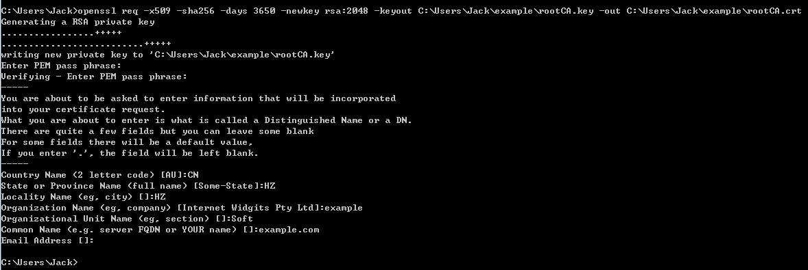
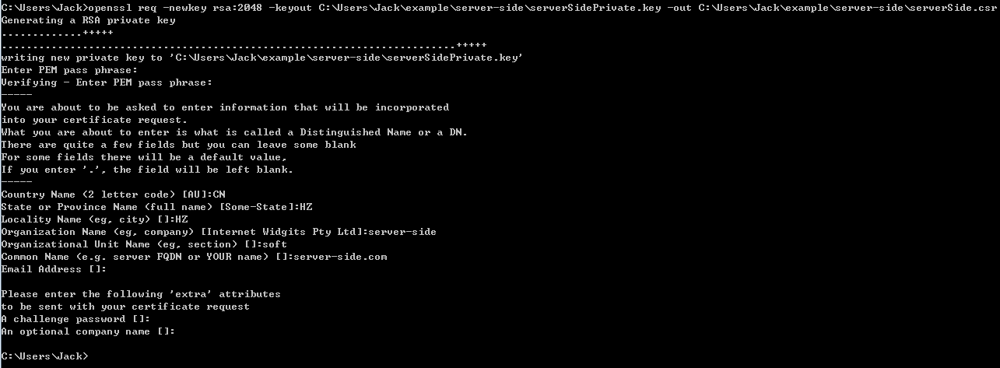
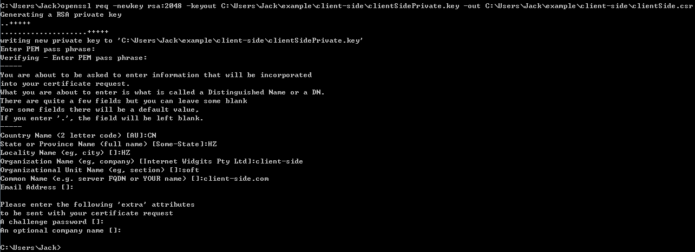
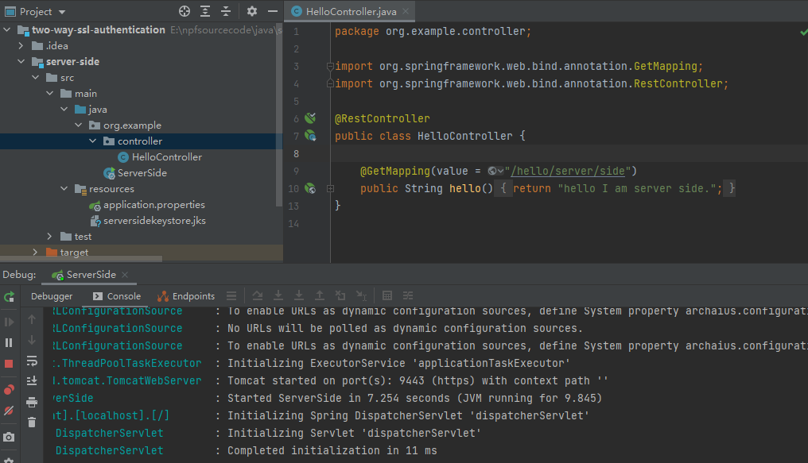
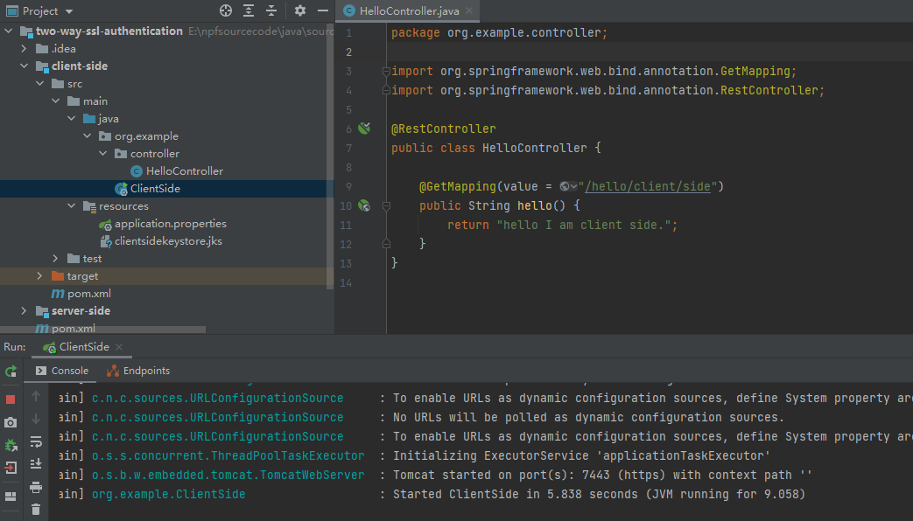
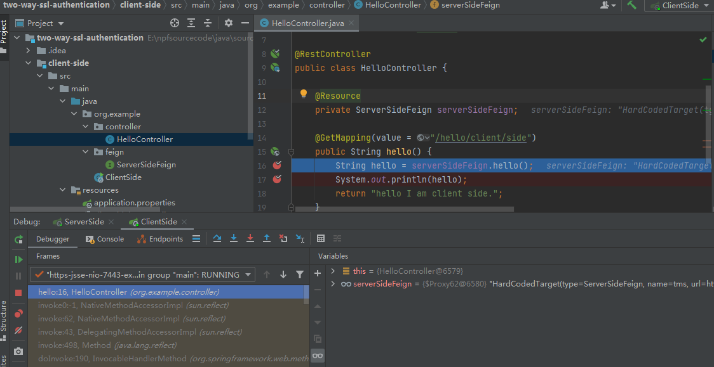
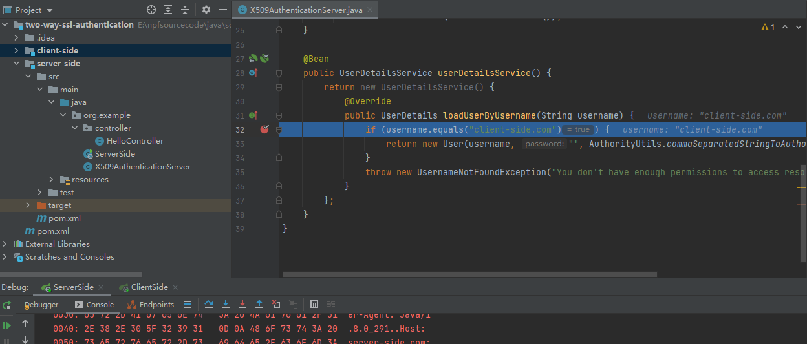
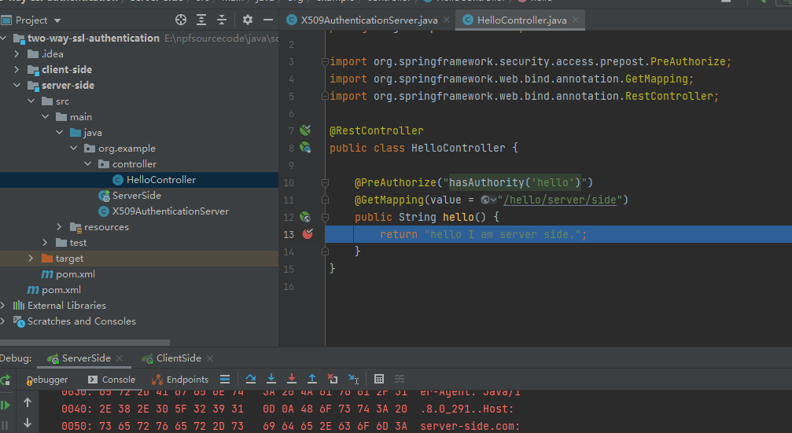
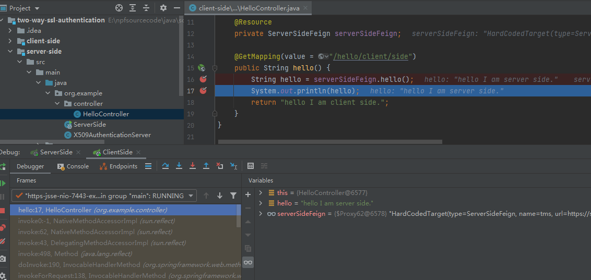
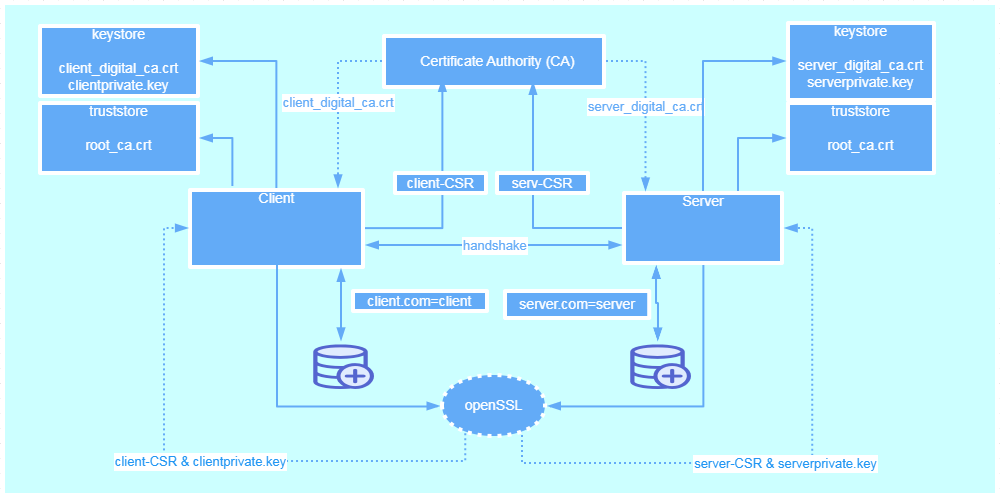

In this article, we'll focus on the main use cases for X.509 certificate authentication – **verifying the identity of a communication peer** when using the HTTPS (HTTP over SSL) protocol.

Simply put – while a secure connection is established, the client verifies the server according to its certificate (issued by a trusted certificate authority).

But beyond that, X.509 in Spring Security can be used to **verify the identity of a client** by the server while connecting. This is called ***“mutual authentication”,\*** and we'll look at how that's done here as well.

Finally, we'll touch on **when it makes sense to use this kind of authentication**.

To demonstrate server verification, we'll create a simple web application and install a custom certificate authority in a browser.

# **1. Introduction**

## **1. 1 Certificate Authority**

To obtain a certificate signed by a certificate authority, you must first create a certificate signing request (CSR). You will then submit the request data to a certificate authority. 

# **2. You should do**

As an example, we will mock a CA. And I think that you are able to know what I want. To be able to sign our client-side and server-side certificates, we need to create our own self-signed root CA certificate first. This way we'll act as our own certificate authority.

```
openssl req -x509 -sha256 -days 3650 -newkey rsa:2048 -keyout C:\Users\Jack\example\rootCA.key -out C:\Users\Jack\example\rootCA.crt
```

After done, you will find the below file on your file system.


When we execute the above command, we need to provide the password for our private key. For the purpose of this document, we use *123456* as a passphrase.



## **2.1 Create a Certificate Signed by a Certificate Authority**

### **Step 1 : Create a CSR and** **private key**

When using a CA issuer other than Let's Encrypt, the first step is to create the CSR. The request data associated with the CSR contains the details about your organization and public key etc. This request data is submitted to your certificate authority for them to publicly certify your organization and public key etc. 

https://www.openssl.org/docs/fips/UserGuide-2.0.pdf

Give an example as follow:

```
openssl req -newkey rsa:2048 -keyout yourprivate.key -out yourcsr.csr
```

After entering the command, you will be asked series of questions. Your answers to these questions will be embedded in the CSR. Answer the questions as described below:

| **Country Name (2 letter code)**             | The two-letter country code where your company is legally located. |
| -------------------------------------------- | ------------------------------------------------------------ |
| **State or Province Name (full name)**       | The state/province where your company is legally located.    |
| **Locality Name (e.g., city)**               | The city where your company is legally located.              |
| **Organization Name (e.g., company)**        | Your company's legally registered name (e.g., YourCompany, Inc.). |
| **Organizational Unit Name (e.g., section)** | The name of your department within the organization. (You can leave this option blank; simply press **Enter**.) |
| **Common Name (e.g., server FQDN)**          | The fully-qualified domain name (FQDN).                      |
| **Email Address**                            | Your email address. (You can leave this option blank; simply press **Enter**.) |
| **A challenge password**                     | Leave this option blank (simply press **Enter**).            |
| **An optional company name**                 | Leave this option blank (simply press **Enter**).            |

#### **server-side**

```
openssl req -newkey rsa:2048 -keyout C:\Users\Jack\example\server-side\serverSidePrivate.key -out C:\Users\Jack\example\server-side\serverSide.csr
```

Some of the above CSR questions have default values that will be used if you leave the answer blank and press Enter. These default values are pulled from the OpenSSL configuration file located in the OPENSSLDIR (see Checking Your OpenSSL Version). If you want to leave a question blank without using the default value, type a "." (period) and press Enter.



After done this action, you can find two files (serverSide.csr and serverSidePrivate.key)in current path of your file system. 

The private key file contains both the private key and the public key. You can extract your public key from your private key file if needed. Use the following command to extract your public key:

```
openssl rsa -in serverSidePrivate.key -pubout -out serverSidePublic.key
```

After create a Certificate Signing Request we can view the files and review it. We will use `req` verb again. We will use `-noout` and `-text` options to print to the shell.

```
openssl req -noout -text -in serverSide.csr
```

#### client-side

```
openssl req -newkey rsa:2048 -keyout C:\Users\Jack\example\client-side\clientSidePrivate.key -out C:\Users\Jack\example\client-side\clientSide.csr
```



After done this action, you can find two files (clientSide.csr and clientSidePrivate.key)in current path of your file system. 

### **Step 2 : Submit the CSR to CA**

Once the certificate signing request has been created, you must submit it to a certificate authority for certification. You can obtain an SSL certificate from a commercial or public certificate authority or from an internal CA server if your organization uses one.

Now, it's time to **sign the request with our \*rootCA.crt\* certificate and its private key.**

```
openssl x509 -req -CA C:\Users\Jack\example\rootCA.crt -CAkey C:\Users\Jack\example\rootCA.key -in C:\Users\Jack\example\server-side\serverSide.csr -out C:\Users\Jack\example\server-side\serverSide.crt -days 365 -CAcreateserial
```

After done, you can find the serverSide.crt on your filesystem.

```
openssl x509 -req -CA C:\Users\Jack\example\rootCA.crt -CAkey C:\Users\Jack\example\rootCA.key -in C:\Users\Jack\example\client-side\clientSide.csr -out C:\Users\Jack\example\client-side\clientSide.crt -days 365 -CAcreateserial
```

After done, you can find the clientSide.crt on your filesystem.

### **Step 3 : Get the Certificate from CA**

Once the certificate authority has the request data (CSA), they will review it and sign it. After the certificate authority has signed the certificate, they will send it back to you, often with the root and/or intermediate certificate files. All these together constitute your certificate chain. The CA or Issuing Authority issues multiple certificates in a certificate chain, proving that your site's certificate was issued by the CA. This proof is validated using a public and private key pair. The public key, available to all of your site visitors, must validate the private key in order to verify the authenticity of the certificate chain.The certificate chain typically consists of three types of certificate:

- Root Certificate - The certificate that identifies the certificate authority.
- Intermediate Root Certificates - Certificates digitally signed and issued by an Intermediate CA, also called a Signing CA or Subordinate CA.
- Identity Certificate - A certificate that links a public key value to a real-world entity such as a web server.

All of these certificate files must be imported to your Application before it will be completely operational. The certificate chain will be sent in one of multiple certificate file formats. The following certificate formats are acceptable:

- DER-encoded X.509 certificate (.cer, .der, .crt)
- PEM-wrapped DER-encoded X.509 certificate (.pem, .crt, .b64)
- DER-encoded PKCS #7 certificates (.p7, .p7b, .p7c)

You must download all of the certificate files in your certificate chain to a secure location.

### **Step 4 : Exchange root certificate**

To insure confidence that you can be trusted by client, you should send root certificate to client, in contrary, you will also get the root certificate from other side. 

## **2.2 Authentication**

Mutual SSL authentication or certificate based mutual authentication refers to two parties authenticating each other through verifying the provided digital certificate so that both parties are assured of the others' identity. In technology terms, it refers to a client (web browser or client application) authenticating themselves to a server (website or server application) and that server also authenticating itself to the client through verifying the public key certificate/digital certificate issued by the trusted Certificate Authorities (CAs). Because authentication relies on digital certificates, certification authorities are an important part of the mutual authentication process. 

In this design document, we'll focus on the main use cases for X.509 certificate authentication – verifying the identity of a communication peer when using the HTTPS protocol. Simply put – while a secure connection is established, the client verifies the server according to its certificate (issued by a trusted certificate authority). But beyond that, X.509 in Spring Security can be used to verify the identity of a client by the server while connecting. This is called “mutual authentication”, and we'll look at how that's done here as well. Finally, we'll touch on when it makes sense to use this kind of authentication.

### **Step1 : Keystore**

A keystore is a repository that our Spring Boot application will use to hold our server's private key and certificate. In other words, our application will use the keystore to serve the certificate to the clients during the SSL handshake. In this design document, I use the Java Key-Store (JKS) format and a [keytool](https://docs.oracle.com/en/java/javase/11/tools/keytool.html) command-line tool.

### **Step 2 : Import certificate to the Keystore**

In this step, we should import the signed certificate and the corresponding private key to the *keystore.jks* file. We'll use the **PKCS 12** archive to package our server's private key together with the signed certificate. Then we'll import it to the newly created *keystore.jks.* 

#### server-side

We can use the following command to create server-side.p12* file:

```
openssl pkcs12 -export -out C:\Users\Jack\example\server-side\serverSide.p12 -name "serverSide" -inkey C:\Users\Jack\example\server-side\serverSidePrivate.key -in C:\Users\Jack\example\server-side\serverSide.crt
```

So we now have the serverSidePrivate*.key* and the serverSidePrivate*.crt* bundled in the single serverSide*.p12* file.

Let's now use keytool to **create a \*keystore.jks\* repository and import the \*serverSide.p12\* file with a single command**:

```
keytool -importkeystore -srckeystore C:\Users\Jack\example\server-side\serverSide.p12 -srcstoretype PKCS12 -destkeystore C:\Users\Jack\example\server-side\serversidekeystore.jks -deststoretype JKS
```

#### client-side

We can use the following command to create client-side.p12* file:

```
openssl pkcs12 -export -out C:\Users\Jack\example\client-side\clientSide.p12 -name "clientSide" -inkey C:\Users\Jack\example\client-side\clientSidePrivate.key -in C:\Users\Jack\example\client-side\clientSide.crt
```

So we now have the clientSidePrivate*.key* and the clientSide*.crt* bundled in the single clientSide*.p12* file.

Let's now use keytool to **create a \*keystore.jks\* repository and import the clientSide\*.p12\* file with a single command**:

```
keytool -importkeystore -srckeystore C:\Users\Jack\example\client-side\clientSide.p12 -srcstoretype PKCS12 -destkeystore C:\Users\Jack\example\client-side\clientsidekeystore.jks -deststoretype JKS
```

At this stage, we have everything in place for the server authentication part. Let's proceed with our Spring Boot application configuration.

### **Step 3 : SSL configuration of Spring Boot**

From now on, we should tell the application where to find our *keystore.jks* and how to access it. We set SSL to an “enabled” status and change the standard listening port to indicate a secured connection.

#### server-side

```
`server.ssl.key-store=serversidekeystore.jks`
`server.ssl.key-store-password=123456`
`server.ssl.key-store-type=JKS`
`server.ssl.key-alias=serverSide`
`server.ssl.key-password=123456`
`server.ssl.enabled=true`
`server.port=9443`
```

Now , we can start server-side , let me show the diagram as follow:



And you can access the server through browser , it shows that the website is not secure, because client doesn't install the rootCA.crt .

#### client-side

```
`server.ssl.key-store=clientsidekeystore.jks`
`server.ssl.key-store-password=123456`
`server.ssl.key-store-type=JKS`
`server.ssl.key-alias=clientSide`
`server.ssl.key-password=123456`
`server.ssl.enabled=true`
`server.port=7443`
```

Now , we can start client-server , let me show the diagram as follow:



And you can access the server through browser , it shows that the website is not secure, because client doesn't install the rootCA.crt .

### **Step 4 : Truststore**

We need to install root certificate as a trusted certificate in our application. In this stage, we'll describe client certificate authentication. This way, only clients with valid certificates signed by the authority certificate that our server trusts, can access our secured website. A trustsore in some way is the opposite of a keystore. **It holds the certificates of the external entities that we trust**. In our case, it's enough to keep the root CA certificate in the truststore. 

#### server-side

Let's see how to create a *truststore.jks* file and import the *rootCA.crt* using keytool:

```
keytool -import -trustcacerts -noprompt -alias serversidetrustothers -file C:\Users\Jack\example\rootCA.crt -keystore C:\Users\Jack\example\server-side\serversidetrustotherstruststore.jks
```

That's it, we've imported root CA certificate, and the truststore is ready to be used. As a final modification step, we have to tell the application where our truststore is located and that SSL client authentication is necessary (server.ssl.client-auth=need). So we put the following into our application.properties:

```
server.ssl.trust-store=classpath:serversidetrustotherstruststore.jks
server.ssl.trust-store-password=123456
server.ssl.client-auth=need
```

#### client-side

Let's see how to create a *truststore.jks* file and import the *rootCA.crt* using keytool:

```
keytool -import -trustcacerts -noprompt -alias clientsidetrustothers -file C:\Users\Jack\example\rootCA.crt -keystore C:\Users\Jack\example\client-side\clientsidetrustotherstruststore.jks
```

```
server.ssl.trust-store=classpath:clientsidetrustotherstruststore.jks
server.ssl.trust-store-password=123456
```

## **2.3 Authorization**

Authorization is the process of giving someone the ability to access a resource. In which case, when server-side and client-side authenticated each other successfully, so they can request data for each other. In such cases, does it mean that they can access all API each other ? No , you should grant access permissions after authenticate successfully, it means that someone only can access the limited resources.

***Before you start your app, please set below JVM parameters.\***

*-[Djavax.net](http://djavax.net/).ssl.keyStoreType=jks*
*-[Djavax.net](http://djavax.net/).ssl.keyStore=E:\npfsourcecode\java\sourcecode\two-way-ssl-authentication\server-side\src\main\resources*\serversidekeystore.jks
*-[Djavax.net](http://djavax.net/).ssl.keyStorePassword=123456*

*-[Djavax.net](http://djavax.net/).ssl.keyStoreType=jks*
**-[Djavax.net](http://djavax.net/).ssl.keyStore=E:\npfsourcecode\java\sourcecode\two-way-ssl-authentication\client-side\src\main\resources*\clientsidekeystore.jks*
*-[Djavax.net](http://djavax.net/).ssl.keyStorePassword=123456*

#### **Step 1 : Spring Security Configuration**

**How to Resolve an unable to find valid certification path to requested target Error**

You may encounter an issue when trying to establish a trusted SSL connection from Artifactory.
During replication and other tasks that need to connect to a remote server, you might see the following error message:

***[ERROR] (o.a.a.r.c.BaseReplicationProducer:97) – Error occurred while performing folder replication for 'XXXX': sun.security.validator.ValidatorException: PKIX path building failed: sun.security.provider.certpath.SunCertPathBuilderException: unable to find valid certification path to requested target: sun.security.validator.ValidatorException:***

This indicates that Artifactory was unable to establish a trusted SSL connection over SSL. This issue might arise if you are using a **self-signed certificate** or a certificate that’s been issued by an **internal certificate authority**, or if your clients (e.g., browser, Java) are **outdated**.

Trust is handled by having the **root** and **intermediate** certificates of your SSL certificate on a trusted keystore. With that said, this may *not* be required if you're using the default JVM security setting.

**Resolution:**

Import the **root** and **intermediate** certificates to the **trusted root certificate** of the Java platform.

```
keytool -importcert -keystore D:\software\java\jdk8\jre\lib\security\cacerts -storepass changeit -file C:\Users\Jack\example\rootCA.crt -alias "rootCAofExample"
```

Let *X509AuthenticationServer* to extend from *WebSecurityConfigurerAdapter* and override one of the provided configure methods. Here we configure the x.509 mechanism to parse the *Common Name (CN)* field of a certificate for extracting usernames. With this extracted usernames, Spring Security is looking up in a provided *UserDetailsService* for matching users. So we also implement this service interface containing one demo user. In production environments, this *UserDetailsService* can load its users from a JDBC Datasource*.* 

You have to notice that we annotate our class with @EnableWebSecurity and @EnableGlobalMethodSecurity with enabled pre-/post-authorization. With the latter we can annotate our resources with @PreAuthorize and @PostAuthorize for fine-grained access control:

```
package org.example;
...

@EnableWebSecurity
@EnableGlobalMethodSecurity(prePostEnabled = true)
public class X509AuthenticationServer extends WebSecurityConfigurerAdapter {

    @Override
    protected void configure(HttpSecurity http) throws Exception {
        http.authorizeRequests().anyRequest().authenticated()
          .and()
          .x509()
            .subjectPrincipalRegex("CN=(.*?)(?:,|$)")
            .userDetailsService(userDetailsService());
    }

    @Bean
    public UserDetailsService userDetailsService() {
        return new UserDetailsService() {
            @Override
            public UserDetails loadUserByUsername(String username) {
                if (username.equals("client-side.com")) {
                    return new User(username, "", AuthorityUtils.commaSeparatedStringToAuthorityList("hello"));
                }
                throw new UsernameNotFoundException("You don't have enough permissions to access resources !");
            }
        };
    }
}
```

As said previously, we are now able to use *Expression-Based Access Control* in our controller. More specifically, our authorization annotations are respected because of the *@EnableGlobalMethodSecurity* annotation in our *@Configuration*:

```
package org.example.controller;

import org.springframework.security.access.prepost.PreAuthorize;
import org.springframework.web.bind.annotation.GetMapping;
import org.springframework.web.bind.annotation.RestController;

@RestController
public class HelloController {

    @PreAuthorize("hasAuthority('hello')")
    @GetMapping(value = "/hello/server/side")
    public String hello() {
        return "hello I am server side.";
    }
}
```

An overview of all possible authorization options can be found in the *[official documentation](https://docs.spring.io/spring-security/site/docs/current/reference/html/authorization.html#method-security-expressions).*

***Step 2 : Test***

***https://localhost:7443/hello/client/side***









# **3. Architecture Overview**

## **3.1 architecture design**




