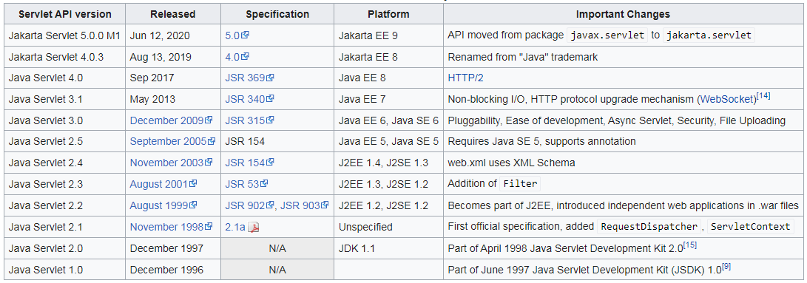
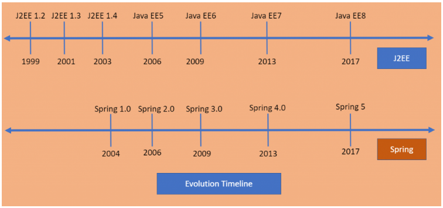
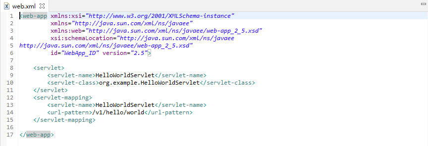
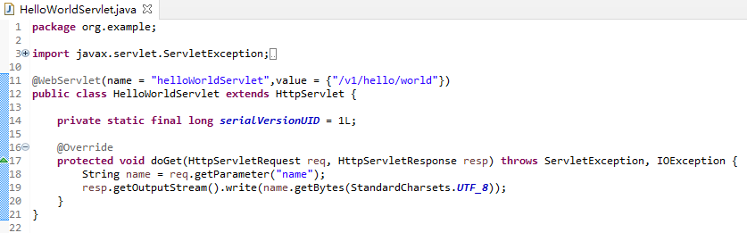
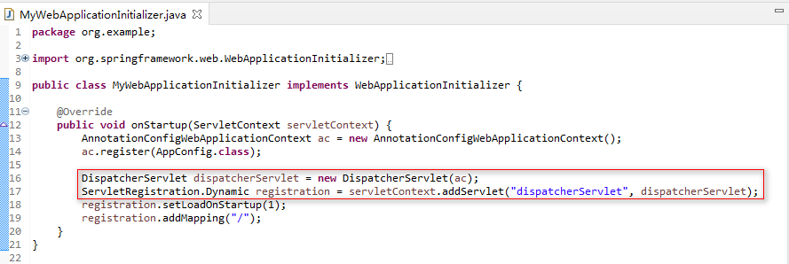
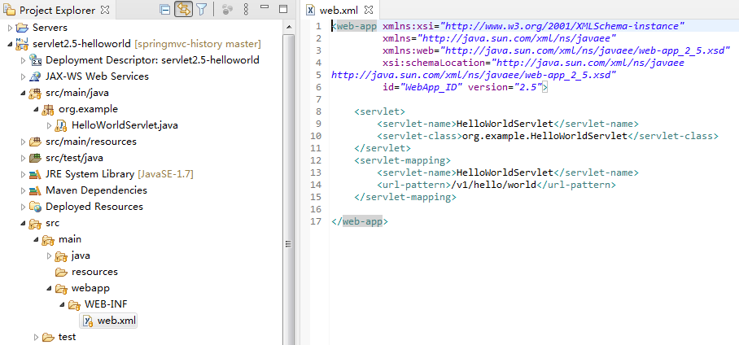

# **1. Introduction**

When using Spring in a web application, we have several options for organizing the application contexts that wire it all up.

In this article, we're going to analyze and explain the most common options that Spring offers.

[https://en.wikipedia.org/wiki/Jakarta_Servlet](https://en.wikipedia.org/wiki/Jakarta_Servlet)

[https://progressivecoder.com/the-rise-of-spring-framework/](https://progressivecoder.com/the-rise-of-spring-framework/)

# How to Register a Servlet in Java

### **2.1. XML-based**

The most common way to register a servlet within your J2EE application is to add it to your *web.xml* file:

As you can see, this involves two steps: (1) adding our servlet to the *servlet* tag, making sure to also specify the source path to the class the servlet resides within, and (2) specifying the URL path the servlet will be exposed on in the *url-pattern* tag. The J2EE *web.xml* file is usually found in *WebContent/WEB-INF*.

[https://download.oracle.com/otn-pub/jcp/servlet-2.5-mrel2-eval-oth-JSpec/servlet-2_5-mrel2-spec.pdf](https://download.oracle.com/otn-pub/jcp/servlet-2.5-mrel2-eval-oth-JSpec/servlet-2_5-mrel2-spec.pdf)

### **2.2 Annotations-based**

Now let's register our servlet using the *@WebServlet* annotation on our custom servlet class. This eliminates the need for servlet mappings in the *web.xml* and registration of the servlet in *web.xml*:

The code above demonstrates how to add that annotation directly to a servlet. The servlet will still be available at the same URL path as before.

[https://download.oracle.com/otn-pub/jcp/servlet-3.0-fr-oth-JSpec/servlet-3_0-final-spec.pdf](https://download.oracle.com/otn-pub/jcp/servlet-3.0-fr-oth-JSpec/servlet-3_0-final-spec.pdf)

### 2.3 **Programmatic-based**

The ability to programmatically add a servlet to a context is useful for framework developers. For example a framework could declare a controller servlet using this method. The return value of this method is a ServletRegistration or a ServletRegistration.Dynamic object which further allows you to setup the other parameters of the servlet like init-params, url-mappings etc.

[https://download.oracle.com/otn-pub/jcp/servlet-3.0-fr-oth-JSpec/servlet-3_0-final-spec.pdf](https://download.oracle.com/otn-pub/jcp/servlet-3.0-fr-oth-JSpec/servlet-3_0-final-spec.pdf)

[https://www.baeldung.com/register-servlet](https://www.baeldung.com/register-servlet)

# **2. The Root Web Application Context**

**Every Spring webapp has an associated application context that is tied to its lifecycle: the root web application context.**

This is an old feature that predates Spring Web MVC, so it's not tied specifically to any web framework technology.

The context is started when the application starts, and it's destroyed when it stops, thanks to a servlet context listener. The most common types of contexts can also be refreshed at runtime, although not all *ApplicationContext* implementations have this capability.

The context in a web application is always an instance of *WebApplicationContext*. That's an interface extending *ApplicationContext* with a contract for accessing the *ServletContext*.

Anyway, applications usually should not be concerned about those implementation details: **the root web application context is simply a centralized place to define shared beans.**

