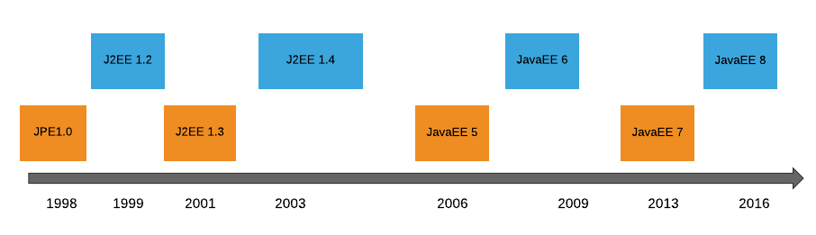
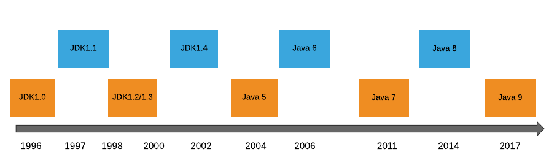
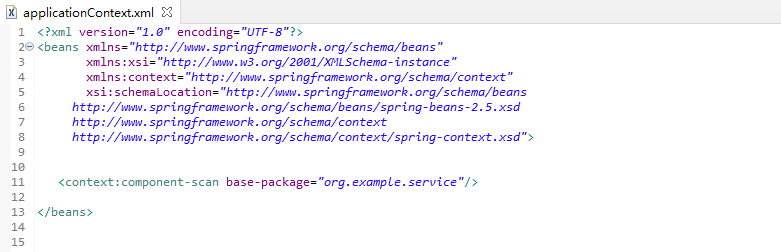
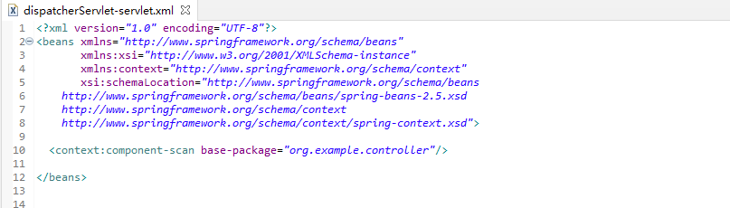

# **1. Introduction**

When using Spring in a web application, we have several options for organizing the application contexts that wire it all up.

In this article, we're going to analyze and explain the most common options that Spring offers.

# **2. Java Ecosystem**

## 2.1 Servlet timeline

## 2.2 J2EE timeline

The Java EE - Java Platform, Enterprise Edition (formerly known as J2EE) has undergone several changes since its inception. This page covers high level time line of different versions and features introduced in each version in chronological order.

## 2.3 Java timeline

Java has been the one of the most used and popular language. This page covers high level time line of different versions and features introduced in each version in chronological order.

# 3. Introduction to Service Provider Interface

## 3.1 **Overview**

Java 6 has introduced a feature for discovering and loading implementations matching a given interface: Service Provider Interface (SPI). Service Provider Interface is an API proposed to be implemented or customized by a third-party provider. It can use as an extension or replaceable by existing implementations. A Service is an extension of the set of interfaces, and Service Provider is an implementation of the service. Classes in the provider category will generally implement the service interface or expand the classes provided in the service. A Service Provider will provide a feature to customize the provider according to the requirements. Service Provider provides the feature to extend the service without modifying the original code base.

## 3.2 **Terms and Definitions of Java SPI**

**Service**

A well-known set of programming interfaces and classes that provide access to some specific application functionality or feature.

**Service Provider Interface**

An interface or abstract class that acts as a proxy or an endpoint to the service.

A specific implementation of the SPI. The Service Provider contains one or more concrete classes that implement or extend the service type. If the service is one interface, then it is the same as a service provider interface. Service and SPI together are well-known in the Java Ecosystem as API.

**Service Provider**

A Service Provider is configured and identified through a provider configuration file which we put in the resource directory *META-INF/services*. The file name is the fully-qualified name of the SPI and its content is the fully-qualified name of the SPI implementation.

The Service Provider is installed in the form of extensions, a jar file which we place in the application classpath, the Java extension classpath or the user-defined classpath.

**ServiceLoader**

At the heart of the SPI is the [*ServiceLoader*](https://docs.oracle.com/en/java/javase/11/docs/api/java.base/java/util/ServiceLoader.html) class. This has the role of discovering and loading implementations lazily. It uses the context classpath to locate provider implementations and put them in an internal cache.

## 3.3 **SPI Samples in the Java Ecosystem**

Java provides many SPIs. Here are some samples of the service provider interface and the service that it provides:

- [*CurrencyNameProvider:*](https://docs.oracle.com/en/java/javase/11/docs/api/java.base/java/util/spi/CurrencyNameProvider.html) provides localized currency symbols for the *Currency* class.
- *[LocaleNameProvider](https://docs.oracle.com/en/java/javase/11/docs/api/java.base/java/util/spi/LocaleNameProvider.html):* provides localized names for the *Locale* class.
- [*TimeZoneNameProvider:*](https://docs.oracle.com/en/java/javase/11/docs/api/java.base/java/util/spi/TimeZoneNameProvider.html) provides localized time zone names for the *TimeZone* class.
- *[DateFormatProvider](https://docs.oracle.com/en/java/javase/11/docs/api/java.base/java/text/spi/DateFormatProvider.html):* provides date and time formats for a specified locale.
- *[NumberFormatProvider](https://docs.oracle.com/en/java/javase/11/docs/api/java.base/java/text/spi/NumberFormatProvider.html):* provides monetary, integer and percentage values for the *NumberFormat* class.
- [*Driver:*](https://docs.oracle.com/en/java/javase/11/docs/api/java.sql/java/sql/Driver.html) as of version 4.0, the JDBC API supports the SPI pattern. Older versions uses the [*Class.forName()*](https://docs.oracle.com/en/java/javase/11/docs/api/java.base/java/lang/Class.html#forName(java.lang.String)) method to load drivers.
- [*PersistenceProvider:*](https://docs.oracle.com/javaee/7/api/javax/persistence/spi/PersistenceProvider.html) provides the implementation of the JPA API.
- *[JsonProvider:](https://docs.oracle.com/javaee/7/api/javax/json/spi/JsonProvider.html)* provides JSON processing objects.
- *[JsonbProvider:](https://javaee.github.io/javaee-spec/javadocs/javax/json/bind/spi/JsonbProvider.html)* provides JSON binding objects.
- [*Extension:*](https://docs.oracle.com/javaee/7/api/javax/enterprise/inject/spi/Extension.html) provides extensions for the CDI container.
- [*ConfigSourceProvider*:](https://openliberty.io/docs/20.0.0.7/reference/javadoc/microprofile-1.2-javadoc.html#package=org/eclipse/microprofile/config/spi/package-frame.html&class=org/eclipse/microprofile/config/spi/ConfigSourceProvider.html) provides a source for retrieving configuration properties.

# 4. Servlet container

## 4.1 Overview

This section provides a list of API specifications which are implemented by Apache Tomcat.

The specifications are developed and maintained by the [Java Community Process (JCP)](https://www.jcp.org/). The members of the JCP are coming from software industry, other organizations like the Apache Software Foundation (ASF), educational institutions but include also individual (personal) members.

Each specifications starts its life as a so-called Java Specification Request JSR. The JSRs are also known by the unique number they receive once the specification process starts. On the web site of the JCP you can find an overview page for each spec, and a separate download page. The download page lists various stages of each spec reflecting the development process of JCP specs. Examples are "Early Draft Review", "Public Final Draft" and "Final Release". You would like to make sure that you always access the latest documents.

Different Tomcat versions implement **different** versions of the specifications (see [main site](https://tomcat.apache.org/whichversion.html), [wiki](https://cwiki.apache.org/confluence/display/TOMCAT/Tomcat+Versions)).

| Spec versions:          | Servlet 2.5                                                  | Servlet 3.0                                                  | Servlet 3.1                                                  |
| ----------------------- | ------------------------------------------------------------ | ------------------------------------------------------------ | ------------------------------------------------------------ |
| Main page:              | [JSR154](https://www.jcp.org/en/jsr/summary?id=154)          | [JSR315](https://www.jcp.org/en/jsr/summary?id=315)          | [JSR340](https://www.jcp.org/en/jsr/detail?id=340)           |
| Stable:                 | Maintenance Release                                          | Final Release                                                | Final Release                                                |
| Date:                   | 11 May, 2006                                                 | 10 Dec, 2009                                                 | 28 May, 2013                                                 |
| Download Page:          | [Overview](https://jcp.org/aboutJava/communityprocess/mrel/jsr154/index.html) [Direct Download - Javadoc, classes](https://download.oracle.com/otndocs/jcp/servlet-2.5-mrel-eval-oth-JSpec/) | [Overview](https://jcp.org/aboutJava/communityprocess/final/jsr315/index.html) [Direct Download](https://download.oracle.com/otndocs/jcp/servlet-3.0-fr-eval-oth-JSpec/) | [Overview](https://jcp.org/aboutJava/communityprocess/final/jsr340/index.html) [Direct Download](https://download.oracle.com/otndocs/jcp/servlet-3_1-fr-eval-spec/index.html) |
| Online Javadoc:         | [Java EE 5](https://docs.oracle.com/javaee/5/api/)           | [Java EE 6](https://docs.oracle.com/javaee/6/api/)           | [Java EE 7](https://docs.oracle.com/javaee/7/api/)           |
| Minimum Tomcat version: | 6.0.0                                                        | 7.0.0                                                        | 8.0.0                                                        |

# 5. Spring

[https://progressivecoder.com/the-rise-of-spring-framework/](https://progressivecoder.com/the-rise-of-spring-framework/)

# 6. How to Register a Servlet in Java

### **6.1. XML-based**

[Servlet-2.5](https://download.oracle.com/otn-pub/jcp/servlet-2.5-mrel2-eval-oth-JSpec/servlet-2_5-mrel2-spec.pdf) The most common way to register a servlet within your J2EE application is to add it to your *web.xml* file:

As you can see, this involves two steps: (1) adding our servlet to the *servlet* tag, making sure to also specify the source path to the class the servlet resides within, and (2) specifying the URL path the servlet will be exposed on in the *url-pattern* tag. The J2EE *web.xml* file is usually found in *WebContent/WEB-INF*.

### **6.2 Annotations-based**

[Servlet-3.0](https://download.oracle.com/otn-pub/jcp/servlet-3.0-fr-oth-JSpec/servlet-3_0-final-spec.pdf) Now let's register our servlet using the *@WebServlet* annotation on our custom servlet class. This eliminates the need for servlet mappings in the *web.xml* and registration of the servlet in *web.xml*:

The code above demonstrates how to add that annotation directly to a servlet. The servlet will still be available at the same URL path as before.

### 6.3 **Programmatic-based**

[Servlet-3.0](https://download.oracle.com/otn-pub/jcp/servlet-3.0-fr-oth-JSpec/servlet-3_0-final-spec.pdf) The ability to programmatically add a servlet to a context is useful for framework developers. For example a framework could declare a controller servlet using this method.

The return value of this method is a ServletRegistration or a ServletRegistration.Dynamic object which further allows you to setup the other parameters of the servlet like init-params, url-mappings etc.

# **7. Web Application**

## 7.1 Servlet 2.5(2005)+tomcat 6.0(2006)+Jdk1.6

**Step1: web.xml**

**Step2: servlet**

## 7.2 Servlet 2.5(2005)+tomcat 6.0(2006)+spring mvc 2.5(2008)+Jdk1.6

**Step1: web.xml**

 

**Step2: applicationContext.xml**

**Step3: dispatcherServlet-servlet.xml**

**Step4: controller**

# **7. The Root Web Application Context**

**Every Spring webapp has an associated application context that is tied to its lifecycle: the root web application context.**

This is an old feature that predates Spring Web MVC, so it's not tied specifically to any web framework technology.

The context is started when the application starts, and it's destroyed when it stops, thanks to a servlet context listener. The most common types of contexts can also be refreshed at runtime, although not all *ApplicationContext* implementations have this capability.

The context in a web application is always an instance of *WebApplicationContext*. That's an interface extending *ApplicationContext* with a contract for accessing the *ServletContext*.

Anyway, applications usually should not be concerned about those implementation details: **the root web application context is simply a centralized place to define shared beans.**

[https://en.wikipedia.org/wiki/Jakarta_Servlet](https://en.wikipedia.org/wiki/Jakarta_Servlet)

[https://www.baeldung.com/register-servlet](https://www.baeldung.com/register-servlet)

[https://cwiki.apache.org/confluence/display/TOMCAT/Specifications](https://cwiki.apache.org/confluence/display/TOMCAT/Specifications)

[https://www.baeldung.com/java-spi](https://www.baeldung.com/java-spi)

https://www.polyglotdeveloper.com/timeline/2015-09-22-Java-EE-timeline/

https://zhuanlan.zhihu.com/p/28909673

https://www.aegissofttech.com/articles/java-service-provider-interface.html
