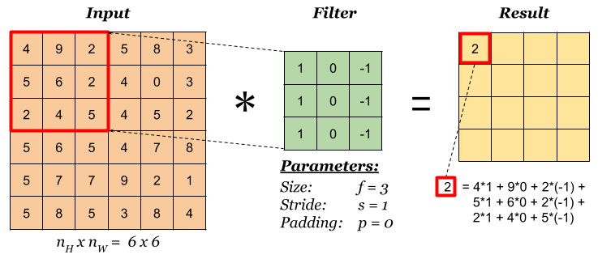
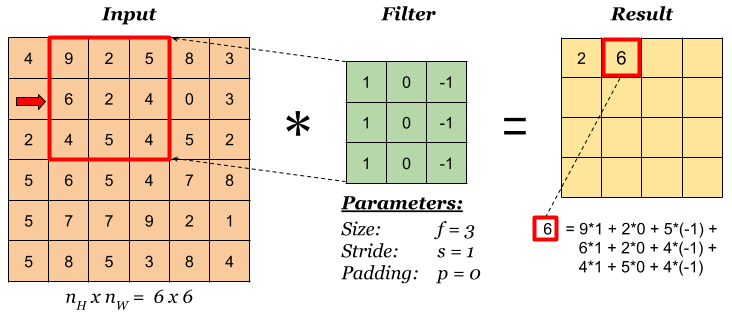
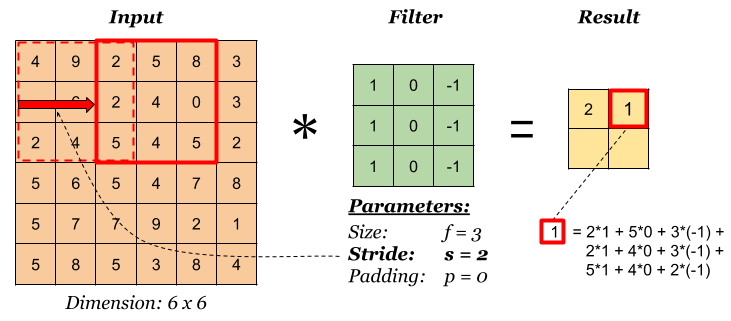
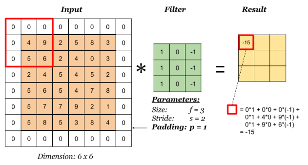
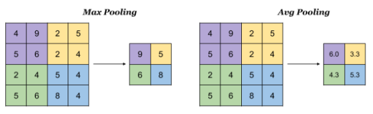
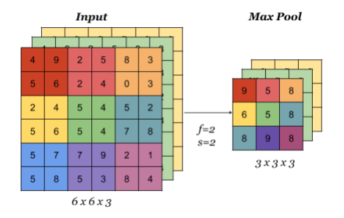
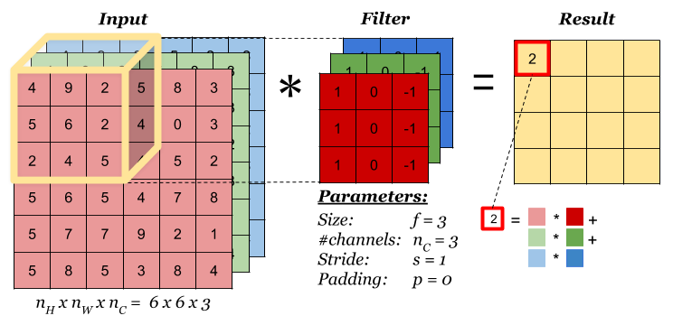
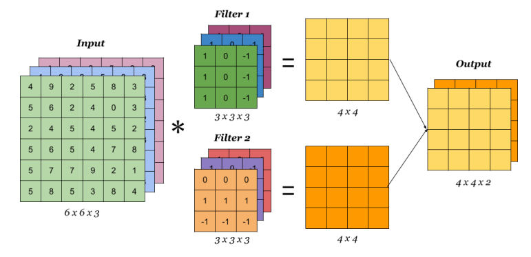

## Why Convolutions

- **Parameter sharing**: a feature detector (such as a vertical edge detector) that’s useful in one part of the image is probably useful in another part of the image.
- **Sparsity of connections**: in each layer, each output value depends only on small number of inputs.

## Convolution Operation on images

### Basic Convolution Operation

**Step 1**: overlay the filter to the input, perform element wise multiplication, and add the result.

**Step 2**: move the overlay right one position (or according to the **stride** setting), and do the same calculation above to get the next result. And so on.

The total number of multiplications to calculate the result above is (4 x 4) x (3 x 3) = 144.

### Stride

Stride governs how many cells the filter is moved in the input to calculate the next cell in the result.

The total number of multiplications to calculate the result above is (2 x 2) x (3 x 3) = 36.

### Padding

Padding has the following benefits:

1. It allows us to use a CONV layer without necessarily shrinking the height and width of the volumes. This is important for building deeper networks, since otherwise the height/width would shrink as we go to deeper layers.
2. It helps us keep more of the information at the border of an image. Without padding, very few values at the next layer would be affected by pixels as the edges of an image.

Notice the dimension of the result has changed due to padding. See the following section on how to calculate output dimension.

Some padding terminologies:

- “**valid**” padding: no padding
- “**same**” padding: padding so that the output dimension is the same as the input

### Pooling

Pooling layer is used to reduce the size of the representations and to speed up calculations, as well as to make some of the features it detects a bit more robust. Sample types of pooling are **max pooling** and **avg pooling**, but these days max pooling is more common.

Interesting properties of pooling layer:

- it has hyper-parameters:
  - **size** (***f***)
  - **stride** (***s***)
  - **type** (max or avg)
- but it doesn’t have parameter; there’s nothing for gradient descent to learn.

When done on input with multiple channels, pooling reduces the height and width (nW and nH) but keeps nC unchanged:

## Convolution Operation on Volume

When the input has more than one channels (e.g. an RGB image), the filter should have matching number of channels. To calculate one output cell, perform convolution on each matching channel, then add the result together.

The total number of multiplications to calculate the result is (4 x 4) x (3 x 3 x 3) = 432.

## Convolution Operation with Multiple Filters

Multiple filters can be used in a convolution layer to detect multiple features. The output of the layer then will have the same number of channels as the number of filters in the layer.

The total number of multiplications to calculate the result is (4 x 4 x 2) x (3 x 3 x 3) = 864.

## Calculating the Output Dimension

The output dimension is calculated with the following formula:

![n^{[l]} = \lfloor \frac {n^{[l-1]} +2p^{[l-1]}-f^{[l]}} {s^{[l]}} + 1 \rfloor  ](E:\my\pengfeinie.github.io\images\rfloor++&bg=ffffff&fg=000000&s=3&c=20201002)

where the  symbols denote *math.floor()* operation.

**links**

1. [https://indoml.com/2018/03/07/student-notes-convolutional-neural-networks-cnn-introduction/](https://indoml.com/2018/03/07/student-notes-convolutional-neural-networks-cnn-introduction/)
