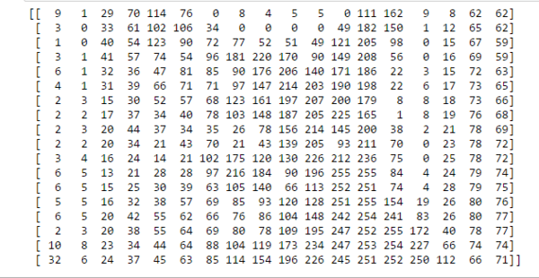
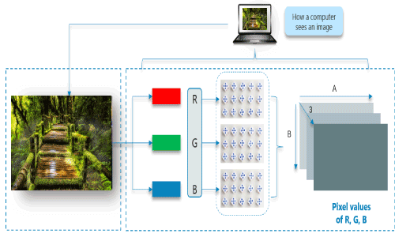

We all love to see beautiful images, but have you ever thought how do computers see an image? In this tutorial, we will give an explanation of how images are stored in a computer.

## How do computers see an image

Consider the above image, a normal human can easily tell that there is a cat in the image. But, can computers really see the cat? The answer is no, computers see a matrix of numbers (between 0 to 255). Broadly, we can classify images as grayscale images or color images.

First, we will discuss grayscale images and then move on to color images. The image above is a grayscale image — that means each pixel represents the brightness of a pixel, which is the smallest controllable element of a picture represented on the screen.

Let us first see what computers see in the case of the above image.

We've resized the above image to 18 * 18 pixels in order to make it easy to understand. Unlike us, the computers see an image as a 2D matrix. You might have heard people saying that this image is of size 1800*700 or 1300 * 700. This size shows width and height of an image. In other words, if size is 1300 * 700 then there are 1300 pixels horizontally and 700 vertically. That means there are total 910,000 (1300*700) pixels. If the image is the size of 700 * 500 then the dimensionality of the matrix will be (700, 500). Here, each element in the matrix represents the intensity of brightness in that pixel. Here, 0 represents black and 255 represents white color, and any value between these two is just a shade of gray.

## Why Convolutions

- **Parameter sharing**: a feature detector (such as a vertical edge detector) that’s useful in one part of the image is probably useful in another part of the image.
- **Sparsity of connections**: in each layer, each output value depends only on small number of inputs.

## Convolution Operation on images

### Basic Convolution Operation

**Step 1**: overlay the filter to the input, perform element wise multiplication, and add the result.

**Step 2**: move the overlay right one position (or according to the **stride** setting), and do the same calculation above to get the next result. And so on.

The total number of multiplications to calculate the result above is (4 x 4) x (3 x 3) = 144.

### Stride

Stride governs how many cells the filter is moved in the input to calculate the next cell in the result.

The total number of multiplications to calculate the result above is (2 x 2) x (3 x 3) = 36.

### Padding

Padding has the following benefits:

1. It allows us to use a CONV layer without necessarily shrinking the height and width of the volumes. This is important for building deeper networks, since otherwise the height/width would shrink as we go to deeper layers.
2. It helps us keep more of the information at the border of an image. Without padding, very few values at the next layer would be affected by pixels as the edges of an image.

Notice the dimension of the result has changed due to padding. See the following section on how to calculate output dimension.

Some padding terminologies:

- “**valid**” padding: no padding
- “**same**” padding: padding so that the output dimension is the same as the input

### Pooling

Pooling layer is used to reduce the size of the representations and to speed up calculations, as well as to make some of the features it detects a bit more robust. Sample types of pooling are **max pooling** and **avg pooling**, but these days max pooling is more common.

Interesting properties of pooling layer:

- it has hyper-parameters:
  - **size** (***f***)
  - **stride** (***s***)
  - **type** (max or avg)
- but it doesn’t have parameter; there’s nothing for gradient descent to learn.

When done on input with multiple channels, pooling reduces the height and width (nW and nH) but keeps nC unchanged:

## Convolution Operation on Volume

When the input has more than one channels (e.g. an RGB image), the filter should have matching number of channels. To calculate one output cell, perform convolution on each matching channel, then add the result together.

The total number of multiplications to calculate the result is (4 x 4) x (3 x 3 x 3) = 432.

## Convolution Operation with Multiple Filters

So far, we have been performing convolution operations on a single matrix or a single channel image which is of a greyscale image. As explained before, the colour images generally consist of 3 channels of red, green and blue RGB. Here the matrix consists of the 3 layers and the filters to which the they are multiplied are of 3 layers too. They values obtained from all three layers are added together to form a single layer matrix. This is also known as the convolution on volume.

And a similar process is carried out of padding, striding and here in the diagram below the red represents the red channel and respectively for others of a total of 3 layers. We can also see that how striding takes place where the mask shifts by 1 unit.

Multiple filters can be used in a convolution layer to detect multiple features. The output of the layer then will have the same number of channels as the number of filters in the layer.

The total number of multiplications to calculate the result is (4 x 4 x 2) x (3 x 3 x 3) = 864.

## Calculating the Output Dimension

The output dimension is calculated with the following formula:

![n^{[l]} = \lfloor \frac {n^{[l-1]} +2p^{[l-1]}-f^{[l]}} {s^{[l]}} + 1 \rfloor  ](../images/rfloor++&bg=ffffff&fg=000000&s=3&c=20201002)

where the  symbols denote *math.floor()* operation.

## Mathematical reasons for convolution in neural networks beyond expediency

On the other hand, convolution is defined as:

**links**

1. [https://indoml.com/2018/03/07/student-notes-convolutional-neural-networks-cnn-introduction/](https://indoml.com/2018/03/07/student-notes-convolutional-neural-networks-cnn-introduction/)

2. [https://insightimi.wordpress.com/2021/02/22/convolution_neural_network/](https://insightimi.wordpress.com/2021/02/22/convolution_neural_network/)
3. [https://www.commonlounge.com/discussion/244616b76d3d40f88e8f12103a22743d](https://www.commonlounge.com/discussion/244616b76d3d40f88e8f12103a22743d)
4. [https://www.javatpoint.com/convolutional-neural-network-in-tensorflow](https://www.javatpoint.com/convolutional-neural-network-in-tensorflow)
