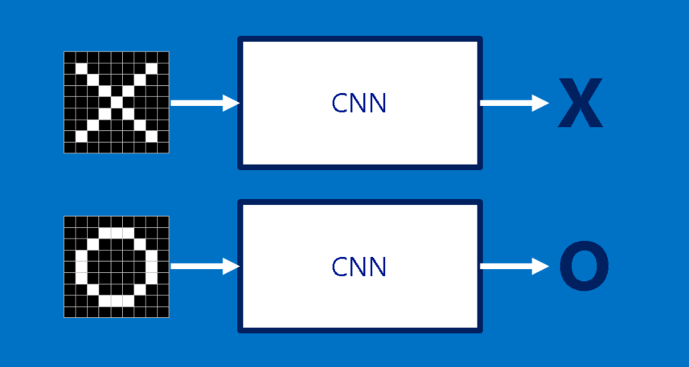
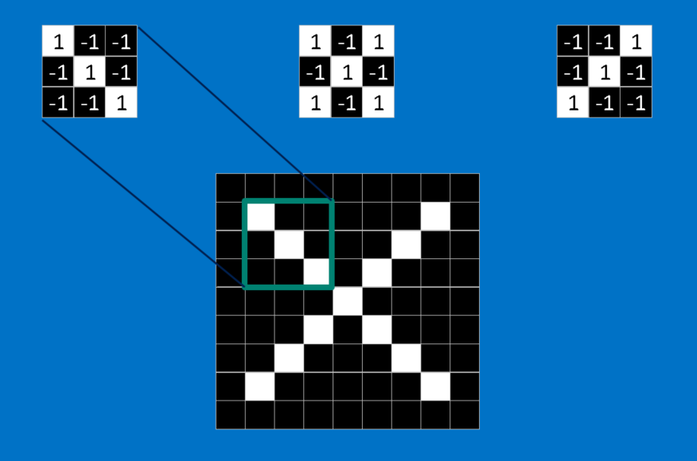
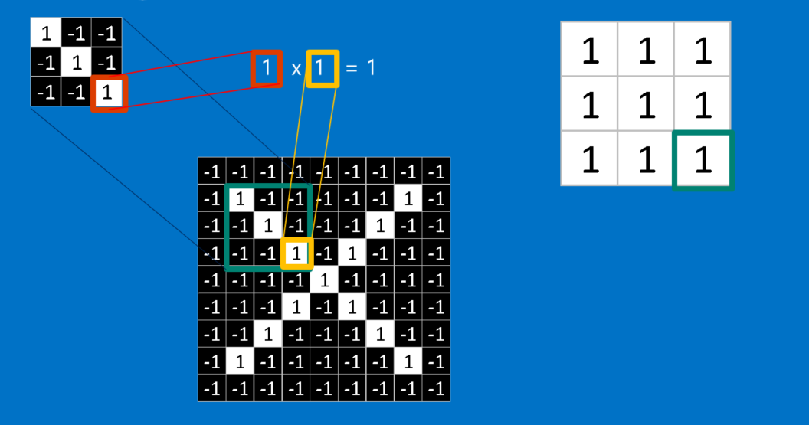

Nine times out of ten, when you hear about deep learning breaking a new technological barrier, Convolutional Neural Networks are involved. Also called CNNs or ConvNets, these are the workhorse of the deep neural network field. They have learned to sort images into categories even better than humans in some cases. If there’s one method out there that justifies the hype, it is CNNs.

What’s especially cool about them is that they are easy to understand, at least when you break them down into their basic parts. I’ll walk you through it.

### X's and O's

To help guide our walk through a Convolutional Neural Network, we’ll stick with a very simplified example: determining whether an image is of an X or an O. This example is just rich enough to illustrate the principles behind CNNs, but still simple enough to avoid getting bogged down in non-essential details. Our CNN has one job. Each time we hand it a picture, it has to decide whether it has an X or an O. It assumes there is always one or the other.

A naïve approach to solving this problem is to save an image of an X and an O and compare every new image to our exemplars to see which is the better match. What makes this task tricky is that computers are extremely literal. To a computer, an image looks like a two-dimensional array of pixels (think giant checkerboard) with a number in each position. In our example a pixel value of 1 is white, and -1 is black. When comparing two images, if any pixel values don’t match, then the images don’t match, at least to the computer. Ideally, we would like to be able to see X’s and O’s even if they’re shifted, shrunken, rotated or deformed. This is where CNNs come in.

### Features

CNNs compare images piece by piece. The pieces that it looks for are called features. By finding rough feature matches in roughly the same positions in two images, CNNs get a lot better at seeing similarity than whole-image matching schemes.

Each feature is like a mini-image—a small two-dimensional array of values. Features match common aspects of the images. In the case of X images, features consisting of diagonal lines and a crossing capture all the important characteristics of most X’s. These features will probably match up to the arms and center of any image of an X.

### Convolution

When presented with a new image, the CNN doesn’t know exactly where these features will match so it tries them everywhere, in every possible position. In calculating the match to a feature across the whole image, we make it a filter. The math we use to do this is called convolution, from which Convolutional Neural Networks take their name.

The math behind convolution is nothing that would make a sixth-grader uncomfortable. To calculate the match of a feature to a patch of the image, simply multiply each pixel in the feature by the value of the corresponding pixel in the image. Then add up the answers and divide by the total number of pixels in the feature. If both pixels are white (a value of 1) then 1 * 1 = 1. If both are black, then (-1) * (-1) = 1. Either way, every matching pixel results in a 1. Similarly, any mismatch is a -1. If all the pixels in a feature match, then adding them up and dividing by the total number of pixels gives a 1. Similarly, if none of the pixels in a feature match the image patch, then the answer is a -1.

To complete our convolution, we repeat this process, lining up the feature with every possible image patch. We can take the answer from each convolution and make a new two-dimensional array from it, based on where in the image each patch is located. This map of matches is also a filtered version of our original image. It’s a map of where in the image the feature is found. Values close to 1 show strong matches, values close to -1 show strong matches for the photographic negative of our feature, and values near zero show no match of any sort.

The next step is to repeat the convolution process in its entirety for each of the other features. The result is a set of filtered images, one for each of our filters. It’s convenient to think of this whole collection of convolutions operations as a single processing step. In CNNs this is referred to as a convolution layer, hinting at the fact that it will soon have other layers added to it.

It’s easy to see how CNNs get their reputation as computation hogs. Although we can sketch our CNN on the back of a napkin, the number of additions, multiplications and divisions can add up fast. In math speak, they scale linearly with the number of pixels in the image, with the number of pixels in each feature and with the number of features. With so many factors, it’s easy to make this problem many millions of times larger without breaking a sweat. Small wonder that microchip manufacturers are now making specialized chips in an effort to keep up with the demands of CNNs.

### Pooling

Another power tool that CNNs use is called pooling. Pooling is a way to take large images and shrink them down while preserving the most important information in them. The math behind pooling is second-grade level at most. It consists of stepping a small window across an image and taking the maximum value from the window at each step. In practice, a window 2 or 3 pixels on a side and steps of 2 pixels work well.

After pooling, an image has about a quarter as many pixels as it started with. Because it keeps the maximum value from each window, it preserves the best fits of each feature within the window. This means that it doesn’t care so much exactly where the feature fit as long as it fit somewhere within the window. The result of this is that CNNs can find whether a feature is in an image without worrying about where it is. This helps solve the problem of computers being hyper-literal.

A pooling layer is just the operation of performing pooling on an image or a collection of images. The output will have the same number of images, but they will each have fewer pixels. This is also helpful in managing the computational load. Taking an 8 megapixel image down to a 2 megapixel image makes life a lot easier for everything downstream.

**links**

1. [https://www.kdnuggets.com/2016/08/brohrer-convolutional-neural-networks-explanation.html](https://www.kdnuggets.com/2016/08/brohrer-convolutional-neural-networks-explanation.html)
