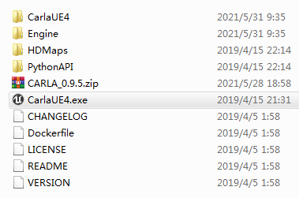
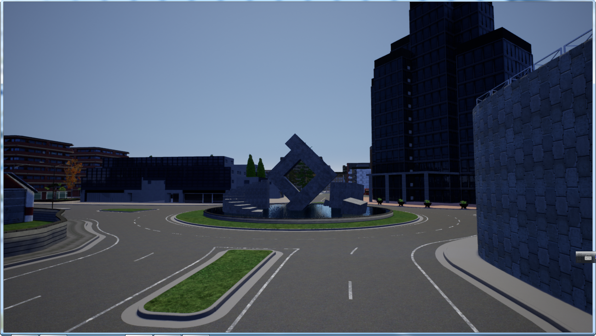
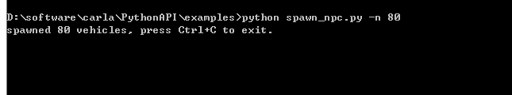
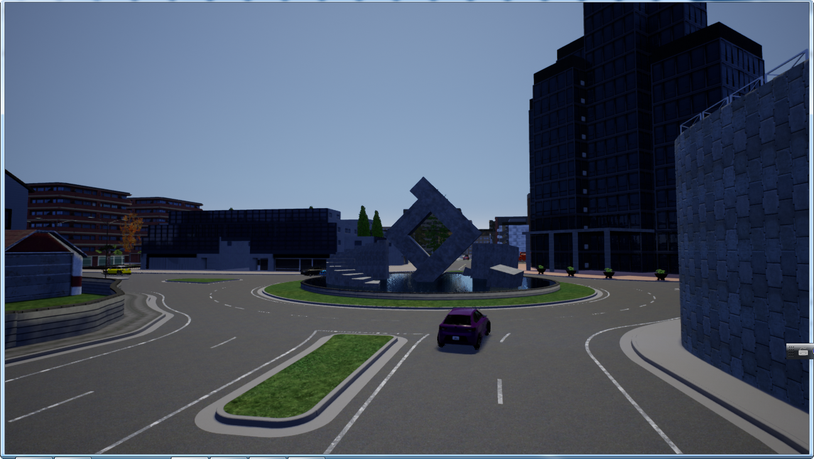
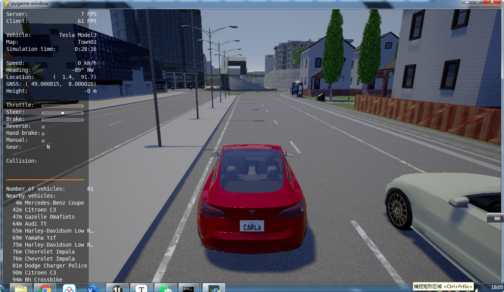

CARLA consists mainly of two modules, the **CARLA Simulator** and the **CARLA Python API** module. The simulator does most of the heavy work, controls the logic, physics, and rendering of all the actors and sensors in the scene; it requires a machine with a dedicated GPU to run. The CARLA Python API is a module that you can import into your Python scripts, it provides an interface for controlling the simulator and retrieving data. With this Python API you can, for instance, control any vehicle in the simulation, attach sensors to it, and read back the data these sensors generate. Most of the aspects of the simulation are accessible from our Python API, and more will be in future releases.

[https://carla.readthedocs.io/en/0.9.5/getting_started/](https://carla.readthedocs.io/en/0.9.5/getting_started/)  

## Install Python

Python is a widely used high-level programming language first launched in 1991. Since then, Python has been gaining popularity and is considered as one of the most popular and flexible server-side programming languages.

Unlike most Linux distributions, Windows does not come with the Python programming language by default. However, you can 

[^1]: https://phoenixnap.com/kb/how-to-install-python-3-windows

** on your Windows server or local machine** in just a few easy steps.

## Download & Install carla 

First of all, download the latest release from our GitHub page and extract all the contents of the package in a folder of your choice.

[https://github.com/carla-simulator/carla/blob/master/Docs/download.md](https://github.com/carla-simulator/carla/blob/master/Docs/download.md) 

The release package contains a precompiled version of the simulator, the Python API module, and some Python scripts with usage examples. In order to run our usage examples, you may need to install the following Python modules

`pip install --user pygame numpy`

Let's start by running the simulator. Launch a terminal window and go to the folder you extracted CARLA to. Start the simulator with the following command.

this launches a window with a view over the city. This is the "spectator" view, you can fly around the city using the mouse and WASD keys, but you cannot interact with the world in this view. The simulator is now running as a server, waiting for a client app to connect and interact with the world.

Let's add now some life to the city, open a new terminal window and execute:

`python spawn_npc.py -n 80`

With this script we are adding 80 vehicles to the world driving in "autopilot" mode. Back to the simulator window we should see these vehicles driving around the city. They will keep driving randomly until we stop the script. Let's leave them there for now.

Now, it's nice and sunny in CARLA, but that's not a very interesting driving condition. One of the cool features of CARLA is that you can control the weather and lighting conditions of the world. We'll launch now a script that dynamically controls the weather and time of the day, open yet another terminal window and execute.

`python dynamic_weather.py`

The city is now ready for us to drive, we can finally run

`python manual_control.py`

This should open a new window with a 3rd person view of a car, you can drive this car with the WASD/arrow keys. Press 'h' to see all the options available.

As you have noticed, we can connect as many scripts as we want to control the simulation and gather data. Even someone with a different computer can jump now into your simulation and drive along with you

`python manual_control.py --host=<your-ip-address-here>`

Now that we covered the basics.