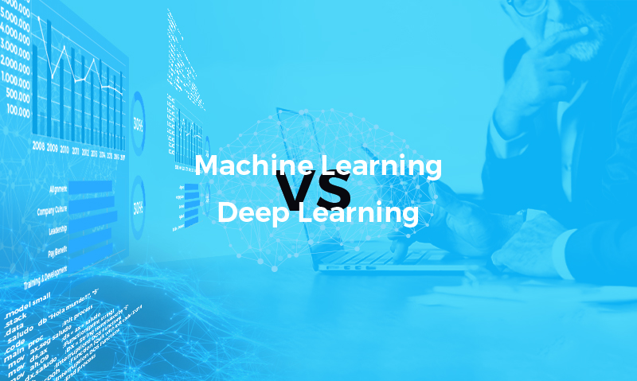
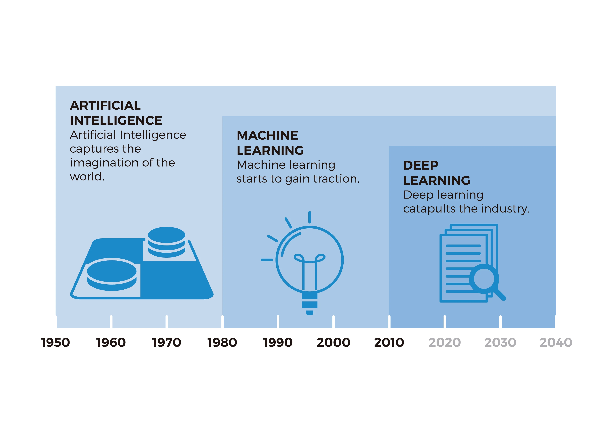
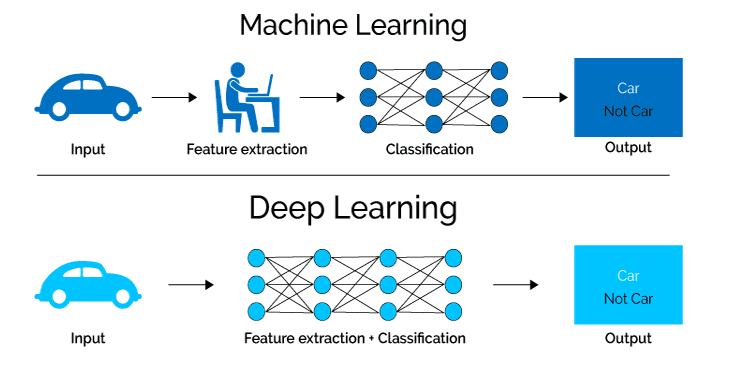

The term “artificial intelligence” has been around since the 1950s, but it’s taken more than half a century for it to finally have a transformative impact on everyday life. During one of those golden moments, in the 1980s, a **branch of AI was born: machine learning** (ML). ML uses mathematical algorithms that allow machines to learn. Machine learning is **an analytical way of solving problems through identification, classification or prediction**. Algorithms learn from entered data and then use this knowledge to draw conclusions from new data. Already in the 21st century, in 2011, a branch of machine learning called deep learning (DL) appeared. The popularity of machine learning and the development of the computing capacity of computers enabled this new technology. Deep learning as a concept is very similar to machine learning but uses different algorithms. While machine learning works with regression algorithms or decision trees, deep learning uses neural networks that function very similarly to the biological neural connections of our brain.

### Machine Learning

Machine learning is baked into much of the tech we use every day. The machine “learns” from past data and adjusts its responses instead of following precise “if this, do that” coding commands. It can also do things like predict whether a stock will rise or fall and estimate your current home price based on recent sales of similar homes.

### Deep Learning

Machine learning has several subsets, but deep learning is the one that gets all the sexy headlines. It’s the “brains” behind language processing, face and image recognition, and even things like hand gesture recognition.

While there’s more than one kind of deep learning, people usually use the phrase to refer to deep neural networks, deep refers to the number of layers in a neural network. There’s an input layer that takes in information, an output layer that gives the response, and “hidden” layers where the learning takes place.

### What's the difference between the two

Simply explained, both machine learning and deep learning **mimic the way the human brain learns**. Its main difference is therefore the type of algorithms used in each case, although deep learning is more similar to human learning as it works with neurons. Machine learning usually uses **decision trees and deep learning neural networks**, which are more evolved. In addition, both can learn in a supervised or unsupervised way.

**Links**

1. [https://www.net-cloud.com/blog/machine-learning-and-deep-learning-101/](https://www.net-cloud.com/blog/machine-learning-and-deep-learning-101/)
2. [https://blog.bismart.com/en/difference-between-machine-learning-deep-learning](https://blog.bismart.com/en/difference-between-machine-learning-deep-learning)

