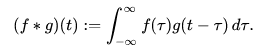
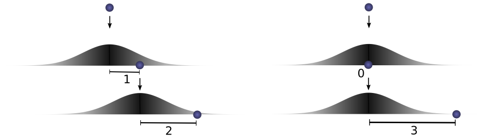
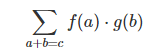
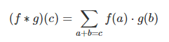
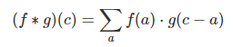
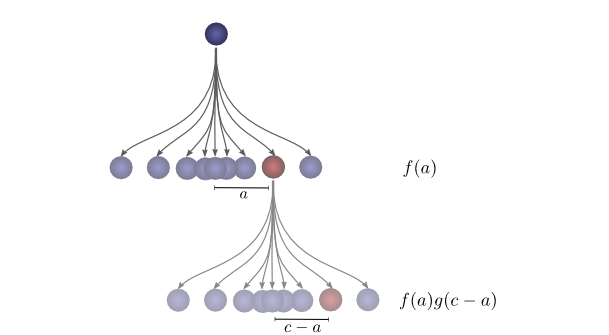
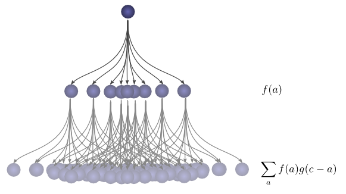

Convolution Neural Network is one among various types of Deep Learning Neural Networks. CNN is very powerful and widely used in image classification, image recognition, computer vision etc.

# Convolution

In [mathematics](https://en.wikipedia.org/wiki/Mathematics) (in particular, [functional analysis](https://en.wikipedia.org/wiki/Functional_analysis)), **convolution** is a [mathematical operation](https://en.wikipedia.org/wiki/Operation_(mathematics)) on two [functions](https://en.wikipedia.org/wiki/Function_(mathematics)) (*f* and *g*) that produces a third function f*g that expresses how the shape of one is modified by the other. The term *convolution* refers to both the result function and to the process of computing it. It is defined as the [integral](https://en.wikipedia.org/wiki/Integral) of the product of the two functions after one is reversed and shifted. The integral is evaluated for all values of shift, producing the convolution function.

## Definition

The convolution of *f* and *g* is written *f*∗*g*, denoting the operator with the symbol ∗.[[B\]](https://en.wikipedia.org/wiki/Convolution#cite_note-3) It is defined as the integral of the product of the two functions after one is reversed and shifted.

## Lessons from a Dropped Ball

Imagine we drop a ball from some height onto the ground, where it only has one dimension of motion. *How likely is it that a ball will go a distance **c** if you drop it and then drop it again from above the point at which it landed?*

Let’s break this down. After the first drop, it will land **a** units away from the starting point with probability **f(a)**, where **f** is the probability distribution.

Now after this first drop, we pick the ball up and drop it from another height above the point where it first landed. The probability of the ball rolling **b** units away from the new starting point is **g(b)**, where gg may be a different probability distribution if it’s dropped from a different height.

If we fix the result of the first drop so we know the ball went distance **a**, for the ball to go a total distance **c**, the distance traveled in the second drop is also fixed at **b**, where **a+b=c**. So the probability of this happening is simply **f(a)⋅g(b)**.[1](https://colah.github.io/posts/2014-07-Understanding-Convolutions/#fn1)

Let’s think about this with a specific discrete example. We want the total distance **c** to be 3. If the first time it rolls, **a=2**, the second time it must roll **b=1** in order to reach our total distance **a+b=3**. The probability of this is **f(2)⋅g(1)**.

However, this isn’t the only way we could get to a total distance of 3. The ball could roll 1 units the first time, and 2 the second. Or 0 units the first time and all 3 the second. It could go any **a** and **b**, as long as they add to 3.

The probabilities are **f(1)⋅g(2)** and **f(0)⋅g(3)**, respectively.

In order to find the *total likelihood* of the ball reaching a total distance of **c**, we can’t consider only one possible way of reaching **c**. Instead, we consider *all the possible ways* of partitioning **c** into two drops **a** and **b** and sum over the *probability of each way*.

We already know that the probability for each case of **a+b=c** is simply **f(a)⋅g(b)**. So, summing over every solution to **a+b=c**, we can denote the total likelihood as:

Turns out, we’re doing a convolution! In particular, the convolution of **f** and **g**, evluated at **c** is defined:

If we substitute **b=c−a**, we get:

This is the standard definition[2](https://colah.github.io/posts/2014-07-Understanding-Convolutions/#fn2) of convolution.

To make this a bit more concrete, we can think about this in terms of positions the ball might land. After the first drop, it will land at an intermediate position **a** with probability **f(a)**. If it lands at **a**, it has probability **g(c−a)** of landing at a position **c**.

To get the convolution, we consider all intermediate positions.

**links**

[https://colah.github.io/posts/2014-07-Understanding-Convolutions/](https://colah.github.io/posts/2014-07-Understanding-Convolutions/)
