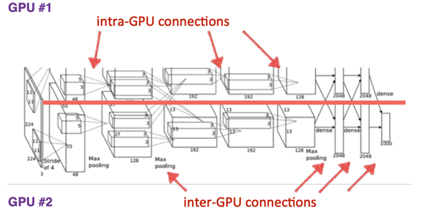
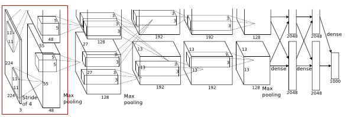
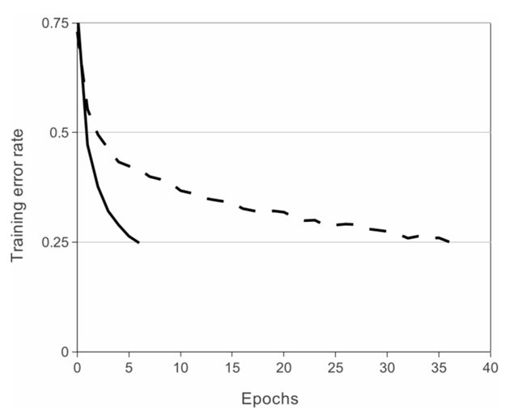

## **History of AlexNet**

AlexNet was primarily designed by Alex Krizhevsky. It was published with Ilya Sutskever and Krizhevsky’s doctoral advisor Geoffrey Hinton, and is a Convolutional Neural Network or CNN.

After competing in ImageNet Large Scale Visual Recognition Challenge, AlexNet shot to fame. It achieved a top-5 error of 15.3%. This was 10.8% lower than that of runner up. 

The primary result of the original paper was that the depth of the model was absolutely required for its high performance. This was quite expensive computationally but was made feasible due to GPUs or Graphical Processing Units, during training.

## **AlexNet Architecture**

AlexNet was the first [convolutional network](https://www.mygreatlearning.com/blog/cnn-model-architectures-and-applications/) which used GPU to boost performance. 

#### Layer 1

Before image(s) is given to this layer, variable resolution images in training set are re-scaled to a fixed size of 256 * 256 as deep neural networks expects all inputs to be of fixed size. This is done by first rescaling the image such that shorter side is of length 256, and then central 256*256 is cropped out.

To prevent overfitting the training images on this net, dropout of 0.5 in some layers and two methods of data augmentation where labels are preserved were used. One is in which random 224 * 224 patches(and their horizontal reflections) were extracted from each image. Thus this method increase the size of training set by reasonable amount. Another is to perform a transformation to vary the intensity and color of illumination for a image as object identity is invariant to these images.

And Rectified Linear unit neurons are used, where its activation function is max(0,x). By using these neurons, training time will be decreased according to the observations.

- Then this 224 * 224 * 3 image is given to 1st convolutional layer.
- Where this layer filters the image with 96 kernels of size 11 * 11 * 3
- Stride - 4, assuming padding is 2 Here stride(s) < kernel size(z) (4 < 11), so this overlapping pooling. According to the paper, the models with overlapping pooling find it slightly more difficult to overfit.
- Therefore output = (224 - 11 + 2 *2)/4 + 1 = 55
- Output is of size 55 * 55 * 96
- To this output, local response normalization(LRN) is applied which is a brightness normalization.
- After LRN, max pooling layer is applied where stride is 2 and kernel size is 3 * 3
- Therefore now output is 27((55 - 3)/2 + 1 ) * 27 * 96

#### **ReLU Nonlinearity** 

Using ReLU non-linearity, AlexNet shows us that deep CNN’s can be trained much faster with the help of saturating activation functions such as Tanh or Sigmoid. The figure shown below shows us that with the help of ReLUs(solid curve), AlexNet can achieve a 25% training error rate. This is six times faster than an equivalent network that uses tanh(dotted curve). This was tested on the CIFAR-10 dataset.

**links**

1. [https://www.mygreatlearning.com/blog/alexnet-the-first-cnn-to-win-image-net/](https://www.mygreatlearning.com/blog/alexnet-the-first-cnn-to-win-image-net/)
2. [https://swethatanamala.github.io/2018/06/23/summary-of-alexnet-paper/](https://swethatanamala.github.io/2018/06/23/summary-of-alexnet-paper/)
3. https://www.datasciencecentral.com/profiles/blogs/alexnet-implementation-using-keras
4. https://medium.com/@pechyonkin/key-deep-learning-architectures-alexnet-30bf607595f1
5. https://learnopencv.com/understanding-alexnet/
6. https://neurohive.io/en/popular-networks/alexnet-imagenet-classification-with-deep-convolutional-neural-networks/
7. https://medium.com/@smallfishbigsea/a-walk-through-of-alexnet-6cbd137a5637
