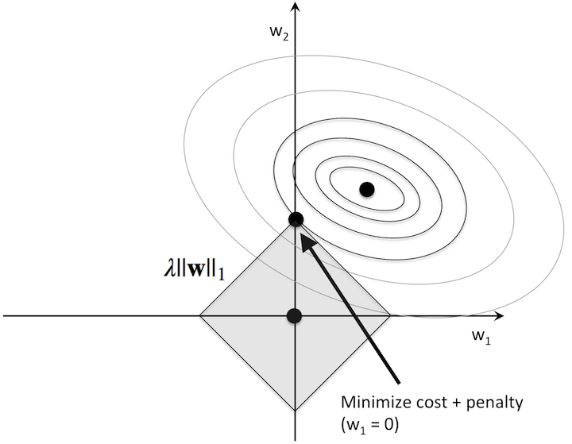

**Regularization Definition**

Regularization is any modification we make to learning algorthm that is extended to reduce its generalization error but not its training error.

**Benefits of Regularization**

**Regularization Can Make Models More Useful by Reducing Overfitting**.

**Overfitting** is a phenomenon that occurs when a Machine Learning model is constraint to training set and not able to perform well on unseen data. 

Regularization is a technique used to reduce the errors by fitting the function appropriately on the given training set and avoid overfitting. Regularization is the most used technique to penalize complex models in machine learning, it is deployed for reducing overfitting (or, contracting generalization errors) by putting network weights small. 

**Regularization Can Make Models More Understandable**

**How to Regularize Neural Network Models**

**General Setup**

Here’s the general setup of regularization for a neural network model, where W represents the weights of your neural network model:

Every neural network has a loss function that is used in training to adjust the neural network’s weights. The loss function measures how different the neural network’s predictions are from the truth.

λ is a hyperparameter that adjusts the tradeoff between having low training loss and having low weights.

- λ (lambda) determines how strongly the regularization will influence the network’s training.
  - If you set λ=0, there is no regularization at all, because you’ve zeroed out the entire regularization term.
  - If you set λ= 1,000,000,000 then that would be extremely strong regularization, which would make it hard for your model to learn anything.
  - Reasonable choices of the regularization strength λ could be 0.001, 0.01, 0.1, 1.0, etc. In the end, the best λ value to use depends on your data set and the problem you are solving. You can check the performance of your model with different λ strengths on your validation set, and then choose the λ that gives the best result. Thus, the regularization strength λ becomes a hyperparameter of your model that you can tune on the validation set.
- *math*(W) represents the actual regularization operation. We’re calling the weights of the neural network W, so regularization is just a mathematical operation on the weights. Different kinds of regularization correspond to different mathematical operations.

## L1 regularization

Here’s the formula for L1 regularization (first as hacky shorthand and then more precisely):

In L1 regularization, we shrink the weights using the absolute values of the weight coefficients (the weight vector ww); λλ is the regularization parameter to be optimized.

For example, we can regularize the sum of squared errors cost function (SSE) as follows:

At its core, L1-regularization is very similar to L2 regularization. However, instead of a quadratic penalty term as in L2, we penalize the model by the absolute weight coefficients. As we can see in the figure below, our "budget" has "sharp edges," which is the geometric interpretation of why the L1 model induces sparsity.

### **Mathematical Formula for L1 regularization**

## L2 regularization

Here’s the formula for L2 regularization (first as hacky shorthand and then more precisely):

In L2 regularization, we shrink the weights by computing the Euclidean norm of the weight coefficients (the weight vector ww); λλ is the regularization parameter to be optimized.

For example, we can regularize the sum of squared errors cost function (SSE) as follows:

Intuitively, we can think of regression as an additional penalty term or constraint as shown in the figure below. Without regularization, our objective is to find the global cost minimum. By adding a regularization penalty, our objective becomes to minimize the cost function under the constraint that we have to stay within our "budget" (the gray-shaded ball).

In addition, we can control the regularization strength via the regularization parameter λλ. The larger the value of λλ, the stronger the regularization of the model. The weight coefficients approach 0 when λλ goes towards infinity.

**links**

1. [https://www.geeksforgeeks.org/regularization-in-machine-learning/](https://www.geeksforgeeks.org/regularization-in-machine-learning/)

2. [http://rasbt.github.io/mlxtend/user_guide/general_concepts/regularization-linear/](http://rasbt.github.io/mlxtend/user_guide/general_concepts/regularization-linear/)

3. [https://www.slideshare.net/KienLe47/regularization-in-deep-learning](https://www.slideshare.net/KienLe47/regularization-in-deep-learning)

4. [https://glassboxmedicine.com/2019/06/08/regularization-for-neural-networks-with-framingham-case-study/](https://glassboxmedicine.com/2019/06/08/regularization-for-neural-networks-with-framingham-case-study/)

5. [https://cmci.colorado.edu/classes/INFO-4604/files/slides-6_regularization.pdf](https://cmci.colorado.edu/classes/INFO-4604/files/slides-6_regularization.pdf)

   

