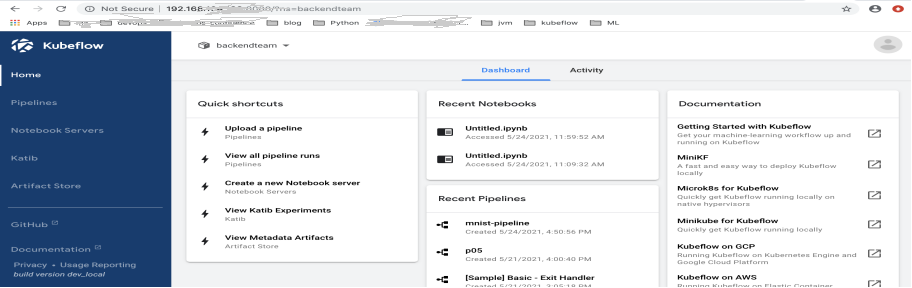

Kubeflow is a platform for data scientists who want to build and experiment with ML pipelines. Kubeflow is also for ML engineers and operational teams who want to deploy ML systems to various environments for development, testing, and production-level serving. Kubeflow is the ML toolkit for Kubernetes. The following diagram shows Kubeflow as a platform for arranging the components of your ML system on top of Kubernetes.

## 1. Prepared Prerequisites

**Before you begin** 
It’s important that you have some knowledge of the following systems and tools:
kfctl 
https://kubernetes.io/docs/tasks/tools/install-kubectl-linux/#install-kubectl-binary-with-curl-on-linux
virtualBox
https://www.virtualbox.org/wiki/Linux_Downloads
minikube
https://v1-18.docs.kubernetes.io/docs/tasks/tools/install-minikube/

**Start minikube for obtaining kubernetes cluster** 
minikube start --driver=virtualbox --cpus=4 --memory=8000m --disk-size=300000m --image-repository=registry.cn-hangzhou.aliyuncs.com/google_containers

If you want to know more about minikube started parameters, you can run command as below:
minikube start --help

## 2. Install Kubeflow

**Prepare your environment** 
Install kfctl

[http://github.com/kubeflow/kfctl/releases](http://github.com/kubeflow/kfctl/releases) 
Download manifest

[https://github.com/kubeflow/manifests/tree/v1.0-branch/kfdef](https://github.com/kubeflow/manifests/tree/v1.0-branch/kfdef) 
Install Kubeflow 
kfctl apply -V -f  kfctl_k8s_istio.v1.0.0.yaml

## 3. View Pods of Kubeflow

## 4. Port forward

The default way of accessing Kubeflow is via port-forward. This enables you to get started quickly without imposing any requirements on your environment. Run the following to port-forward Istio's Ingress-Gateway to local port 8080:
**kubectl port-forward --address 0.0.0.0 -n istio-system svc/istio-ingressgateway 8181:80** 

[https://github.com/kubeflow/manifests#port-forward](https://github.com/kubeflow/manifests#port-forward )  

In order to connect to Kubeflow using NodePort / LoadBalancer / Ingress, you need to setup HTTPS. The reason is that many of our web apps (e.g., Tensorboard Web App, Jupyter Web App, Katib UI) use Secure Cookies, so accessing Kubeflow with HTTP over a non-localhost domain does not work. Exposing your Kubeflow cluster with proper HTTPS is a process heavily dependent on your environment. For this reason, please take a look at the available Kubeflow distributions, which are targeted to specific environments, and select the one that fits your needs.

## 5. Overview of Kubeflow UI

- Home, a central dashboard for navigation between the Kubeflow components.
- Pipelines for a Kubeflow Pipelines dashboard.
- Notebook Servers for Jupyter notebooks.
- Katib for hyperparameter tuning.
- Artifact Store for tracking of artifact metadata.

## 6. Set Up Your Notebooks

You can set up multiple notebook servers per Kubeflow deployment. Each notebook server can include multiple notebooks. Each notebook server belongs to a single namespace, which corresponds to the project group or team for that server.
[https://www.kubeflow.org/docs/components/notebooks/setup/](https://www.kubeflow.org/docs/components/notebooks/setup/) 

Summary of steps:

1. Set up your Kubeflow deployment and open the Kubeflow UI.
2. Click Notebook Servers in the left-hand panel of the Kubeflow UI.
3. Choose the namespace corresponding to your Kubeflow profile.
4. Click NEW SERVER to create a notebook server.
5. When the notebook server provisioning is complete, click CONNECT.
6. Click Upload to upload an existing notebook, or click New to create an empty notebook.

## 7. Kubeflow Pipelines UI

kubeflow Pipelines offers a few samples that you can use to try out Kubeflow Pipelines quickly.
[https://www.kubeflow.org/docs/components/pipelines/pipelines-quickstart/](https://www.kubeflow.org/docs/components/pipelines/pipelines-quickstart/) 

1. Click the name of the sample, [Tutorial] Data passing in python components, on the pipelines UI:
2. Click Create experiment: 
3. Follow the prompts to create an experiment and then create a run. The sample supplies default values for all the parameters you need. The following screenshot assumes you’ve already created an experiment named My experiment and are now creating a run named My first run:
4. Click Start to run the pipeline.
5. Click the name of the run on the experiments dashboard:
6. Explore the graph and other aspects of your run by clicking on the components of the graph and the other UI elements:

