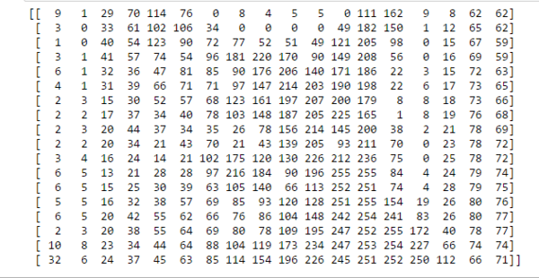
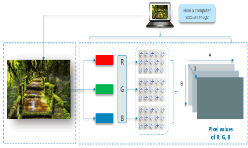

## How do computers see an image

We all love to see beautiful images, but have you ever thought how do computers see an image? In this tutorial, we will give an explanation of how images are stored in a computer.

Consider the above image, a normal human can easily tell that there is a cat in the image. But, can computers really see the cat? The answer is no, computers see a matrix of numbers (between 0 to 255). Broadly, we can classify images as grayscale images or color images.

First, we will discuss grayscale images and then move on to color images. The image above is a grayscale image — that means each pixel represents the brightness of a pixel, which is the smallest controllable element of a picture represented on the screen.

Let us first see what computers see in the case of the above image.

We've resized the above image to 18 * 18 pixels in order to make it easy to understand. Unlike us, the computers see an image as a 2D matrix. You might have heard people saying that this image is of size 1800*700 or 1300 * 700. This size shows width and height of an image. In other words, if size is 1300 * 700 then there are 1300 pixels horizontally and 700 vertically. That means there are total 910,000 (1300*700) pixels. If the image is the size of 700 * 500 then the dimensionality of the matrix will be (700, 500). Here, each element in the matrix represents the intensity of brightness in that pixel. Here, 0 represents black and 255 represents white color, and any value between these two is just a shade of gray.

https://www.commonlounge.com/discussion/244616b76d3d40f88e8f12103a22743d

https://www.javatpoint.com/convolutional-neural-network-in-tensorflow

### Convolutional neural network – architecture

Let’s start with the fact that a convolutional neural network consists of two sub-nets. The first of them converts the input tensor. The second one is a classic densely connected neural network, terminated with a layer, which classifies the input data into *N* classes – as in the example from [the first part of the tutorial](https://aigeekprogrammer.com/convolutional-neural-network-image-recognition-part-1/). The convolutional subnet usually processes three-dimensional data, i.e. unprocessed except for normalization. A densely connected network, on the other hand, requires data flattened to one dimension.

Figure no. 1: Convolutional neural network – high-level architecture

If we adopt this somewhat artificial division into sub-nets (and knowing from other post [how to classify image data using a classic neural network](https://aigeekprogrammer.com/keras-python-mnist-handwritten-digit-recognition/)), we can basically focus further on the first element only, i.e. on the convolutional part.

Before we go deeper into the architecture of the convolutional network, let’s think for a moment why Convnets handle images so well? If you read my post about [handwriting classification](https://aigeekprogrammer.com/keras-python-mnist-handwritten-digit-recognition/), you may remember that all the numbers were more or less in the center of the picture. It looked something like this:

The neural network did well with the classification, being sure that what is most interesting will always be in the center of the image. But wait, what if the digit were shifted to one side? Like this:

 

Probably a classic neural network, in addition trained on centrally located digits, would not be able to handle such data. There is a term “translational invariance”. This means that we can recognize an object as the right object, even if its appearance or location has changed to some extent: by shifting, rotating, changing the size, colors, brightness, etc. As in the example above, when we moved zero to the upper left corner, and yet for the human brain it is unquestionably still zero. For a non-translational-invariance neural network, it will be a non-zero object – probably impossible to classify for a network trained on centered symbols. It is noteworthy that the word “translational” is a bit confusing. This is not about translation at all, but rather about transitioning. It was taken from geometry, where it means shifting each pixel in the same way.

Convnets are insensitive to location because their central element is the convolution operation, which involves processing each part of the image with the same filter value. In other words: the convolution does not look at the center of the image or any other area. It runs with the filter throughout entire image, and reports characteristic values in places where it finds an interesting feature.

Figure no. 2: convolution – step no. one

Figure no. 2 presents graphically how we perform the convolution operation on a 5×5 pixel image labeled *Input*, using a 3×3 size filter. The filter was initialized with values that have already appeared in the first part of the tutorial, when we tried to sharpen the edges of an image. The filter is projected onto the image (green frame), and then the value of each pixel of the image is multiplied by the corresponding filter value. As a result, we get the value of -74. Calculations were presented under the *output*.

In the next step, the filter is moved one position to the right and the calculations are repeated. As a result we get the value of -96.

Figure no. 3: convolution – step no. two

For the last step we get the value of -43, as shown in Figure 4 below.

Figure no. 4: convolution – step no. nine

The filter runs all over the input, from left to right and from top to bottom, ultimately filling the output with values.

Figure no. 5: moving the filter through the image

As you can see, as a result of image convolution we can get values below 0, as well as greater than 255. However, we should remember that the purpose of convolution in the neural network is to detect the image features, not visualization after processing with the filter. Hence, it doesn’t really matter until we want to display the image after the convolution (and this happens quite rarely during the training process). If we want to visualize some intermediate state, we should first shift the values, and only in the second step truncate those above 255 to 255, and those below 0 to the value of 0. The issue of: with what value should we shift data is quite complicated and goes beyond the scope of this tutorial. If you are interested in that, please refer to this [thread on stackoverflow](https://stackoverflow.com/questions/53027923/how-do-you-handle-negative-pixel-values-after-filtering) first.

In summary, data after convolution become insensitive to the location of the object. No matter where it is in fact located, a convolution will be able to find it and return a characteristic set of data for it. The set which is recognizable later by the densly connected neural network. In this sense, Convnets are insensitive to changes in the location of the object and this is one of the main reasons why they classificate images so well.

Like a classic neural sub-net, a convolutional sub-net can be multi-layered. This means that each subsequent layer is able to find more image features. What’s more, each layer of convolution is also multidimensional, because for each layer *N* filters are defined (see Figure 6 below). Filter values are differently initialized for each of them and they can therefore find better or worse image features important for correct classification. The back propagation algorithm will reduce the importance of inefficient filters, and promote those that support proper classification. Therefore, after many, many iterations, we will have a set of effective filters. Effective in terms of helping the network correctly classify images, and ultimately correctly generalize the classification process.

Figure no. 6: multilayered convolutional network

Another important element of Convnets is the implementation of the so-called maxpooling operation. What is maxpooling is also best to explain visually.

Figure no. 7: maxpooling operation

We analyze the values of four adjacent pixels, select the largest value and it becomes the output / result of the operation. In the next step, we move the operation window to the next group of pixels and repeat the calculations. Unlike convolution, maxpooling windows do not overlap. Therefore, in our example, the next window will be pixels: 114, 105, 182 and 75.

Maxpooling can also be done on a larger sample, e.g. 3×3, 4×4, etc. Note that M x M maxpooling reduces the size of the image by M2. So the 32 x 32 image (1024 pixels), after 2×2 maxpooling will have the dimension of 16×16 = 256 pixels, or 22 times less.

What is a purpose of maxpooling? You’ve already learned the main reason above. Dimensionality is reduced without loss of information relevant to the classification, which simplifies the problem computationally. After performing the convolution (here in the sense: after applying the filter to a given area of the image), we are only interested in whether a significant feature was found in a given area or not. We are not interested in every single pixel value after convolution, but only those values that give a strong answer (strong hint) for our network. Therefore, we look at the values of neighboring pixels and choose the largest – the most important value from them. Furthermore, maxpooling helps identify the elements of the image that are most visible. As a result, we also achieve a higher level of “translational invariance”.

In addition to the maxpooling operation, there is also an average pooling (we calculate the average instead of the maximum) and minpooling, but they are not widely used in Convnets.

### Dimensioning of convolutional neural network

As you may have noticed in Figures 2 to 5, the convolution on a 5×5 image with a 3×3 filter resulted in a new 3×3 “image”. Hence the simple conclusion that the convolution may change the dimensions of processed data and it is worth understanding how these dimensions change and how to control these changes. Since I am trying to use the Keras API on the blog, I will use the code line, which we will see later, and which defines the parameters of one of the convolutional layers:

**`Convolution2D(filters=32, kernel_size=(3,3), activation='relu',``padding='same'``)`**

The above code creates a convolutional layer with 32 filters, each with 3×3 dimension, and the output from the layer additionally goes through the *relu* activation function. The padding option is important for this problem, set here to the *same* value, which means that after the image will be converted, it will have the same size. How is this possible? As the name suggests, we use an artificially added margin (padding), filled with zeros. Keras and Tensorflow offer two ways to handle margins: *same* and *valid*.

The valid mode was seen in the examples shown in Figures 2 to 5. The filter does not go outside the image area and thus, the output image is smaller. There is even a simple formula for this. If the image is D x D (in our example 5 x 5) and the filter is N x N (here: 3 x 3), then the size of the resulting image can be calculated from the formula: D – N + 1. For our example it will be 5 – 3 + 1 = 3.

The “same” mode preserves the size of the image after processing by convolution. So that input and output from the convolutional layer will be of the same size. To achieve this, Keras and other frameworks choose the margin size so that the filter passes the image with the margin as many times as the size of the input image. In our case, Keras will add one pixel of margin (padding) to the 5 x 5 image.

Figure 8 – padding types

It is worth noting that for small images – such as in the CIFAR-10 dataset – padding in *same* mode could be better, so that the size of the output image from the convolution does not drop too quickly, because then we will not be able to add the second and subsequent convolutional layers or perform maxpooling.

[https://aigeekprogrammer.com/convolutional-neural-network-image-recognition-part-2/](https://aigeekprogrammer.com/convolutional-neural-network-image-recognition-part-2/)